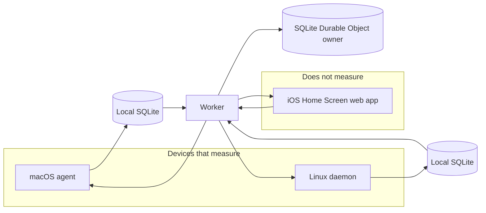
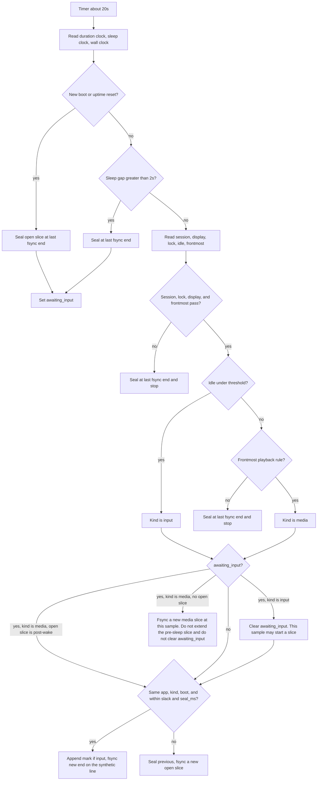
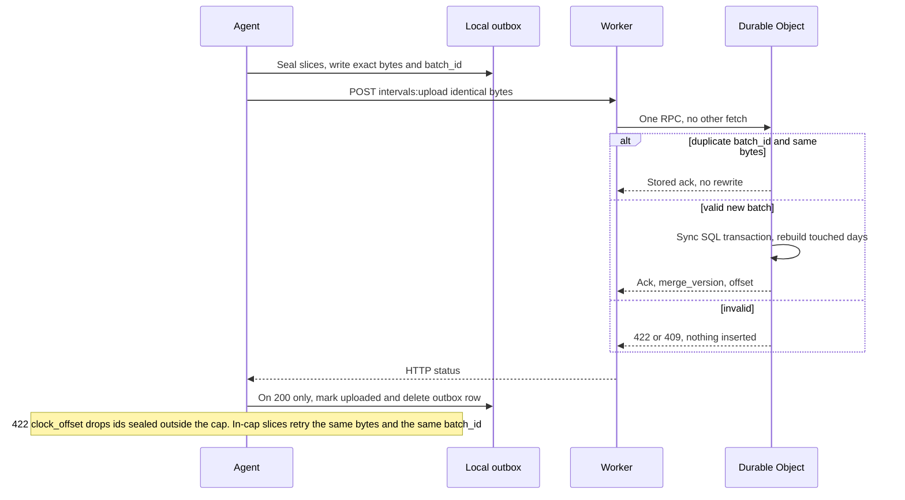
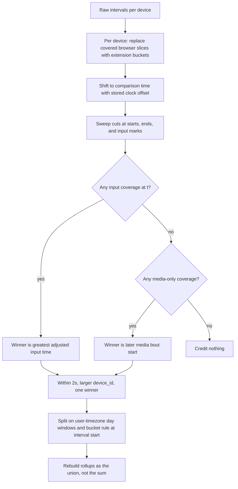
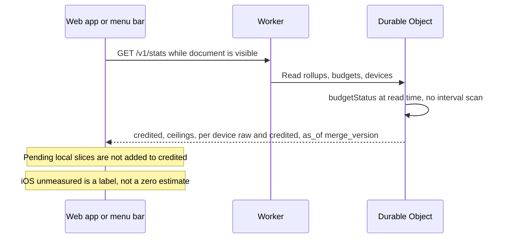

# Workholic: attention budget architecture and reliability plan

**Date:** 2026-10-03
**Status:** Draft
Written before any application code existed. This document cites the research reports listed under References.

---

## Overview

Workholic is a personal attention budget for one person. The shippable collectors are macOS and Linux. Each keeps a durable local log and later uploads **closed intervals**. Cloudflare stores one raw log per device and merges it. The budget reads **credited** time: the measure of the union across devices, with each overlapping instant given to exactly one device. The device that receives credit is the one with the latest real input, not the one that started its bout earlier and not the one that appears first in a host list.

The ceiling is a maximum, not a target. Sampling is about 20 seconds. Being wrong by about 15 minutes is acceptable. Inventing hours is not. Sleep, crash, lock, display sleep, a switched-away session, and time the collector was not running are holes. Nothing backfills a hole.

**Phone usage is absent.** The phone can open the same site and see the computer budget. It cannot contribute usage. That misses a goal this product was asked to meet, and no design in this document pretends otherwise. The shippable collectors stay macOS and Linux. Settings reads a private power log that third-party apps do not get; a third-party app sees only the phone's overall battery percentage. Screen Time numbers are drawn inside `DeviceActivityReport`, and Apple DTS (March 2026, developer-forum thread 818174) said that sandbox is intentional so the host app cannot export the number. An iOS 26.4.1 device log still shows the App Group write denied (`research-ios-screentime.md`). The iOS 26.4 `activityData` export is a different API, EU-customer-only, one app at a time, unproven on TestFlight and App Store builds, and it is frontmost time, not attention. This document does not add an iOS collector, a private power-log reader, or a Screen Time import. An installed web app cannot see other apps, whether the screen is on while this app is hidden, touch outside its own page, or other apps' audio, and Safari through iOS 27 does not provide Idle Detection, Background Sync, or Periodic Background Sync (`research-ios-pwa.md`). Web Push is user-visible only and is not a sampler. A future iOS binary may speak the same sync protocol as a viewer. v1 rejects its intervals. `unmeasured: true` is a label. It is not a measurement of zero.

**Playback.** Count time when video is playing. Where video and audio can be told apart, audio-only playback does not count. Where they cannot, the playback counts. The desktop browser extension can tell them apart. A macOS or Linux collector cannot. The native rule, the extension rule, and the one limit of the native signal are in Capture. Latest real input still beats playback. Playback does not update `last_input`.

Inserting the same interval rows costs the same number of interval writes at any upload cadence (`research-cloudflare.md`). Rebuilding a day's derived rows on every successful insert does not. Storage and money publishes both. One Worker and one SQLite Durable Object per user are the whole backend. There is no D1, KV, R2, Analytics Engine, Queues, or Access-as-login in v1.

Two product choices are still open: Open questions 2 and 4. Questions 1 and 3 are decided in this draft. Everywhere else this document assumes the recommended default so an engineer can build it.

---

## Background and motivation

The useful quantity is attended foreground time: this login session is the console session, the user can see a display, the screen is not known to be locked, and keyboard, pointer, or scroll input is recent. That is not gaze, and it is not "the machine is on." A second device in the same minute must not add a second minute. Existing tools do not implement that rule (`research-prior-art.md`):

- ActivityWatch keeps a raw stream per watcher and intersects window time with not-afk, which is the right shape for "machine on is not attention." Its multidevice query then calls `union_no_overlap` in host-list order. The earlier host wins the overlap. Sync copies folders; it does not merge.
- RescueTime adds computers together and documents totals that can exceed clock time.
- Timing double-counts unless the user adds a manual covering entry.
- Rize claims no double-count and does not publish the rule.
- Qbserve does not combine Macs.
- ManicTime's docs are silent on automatic cross-device dedupe.

A 15-minute upload cadence was proposed to save database money. Cloudflare bills Durable Object SQLite **per row written**, not per HTTP request. Uploading the same interval rows every 30 seconds does not cost more interval writes than uploading them every 15 minutes. Storing one row per 20–30 second sample for two years does blow the free size caps (`research-cloudflare.md`). The interval is why v1 rejects per-sample rows. The upload timer is also a radio and sleep choice. It is a billing control for derived-row rebuilds, which Storage and money counts. It is not why intervals were chosen over sample rows.

Platform capture is possible on macOS without Accessibility, and on some Linux desktops without root, and impossible as a phone-wide meter under the constraint "Home Screen web app only, no TestFlight, no ad-hoc, no sideload" (`research-macos.md`, `research-linux.md`, `research-ios-pwa.md`).

---

## Goals and non-goals

### Goals

Each goal is also a constraint. Conformance is the next section. The short list:

1. Linux and macOS now. A later iOS App Store app must be able to be a client. Android is much later.
2. The phone UI and the laptops sync.
3. One ceiling for attention, over every device that can actually measure. The ceiling is a maximum.
4. Attribute time app by app. Apps can be placed in buckets. A bucket may later have its own ceiling. The overall ceiling matters first.
5. The browser starts as one app. Later, site or user buckets replace browser time for the covered slice. They are not added to it.
6. Count only while the user is attending. Sleep, lock, display sleep, and a switched-away session are not attention.
7. Sample about every 15–30 seconds. About 15 minutes of error is acceptable. Invented hours are not.
8. Offline local storage is required. Late upload merges. The 15-minute idea is not the cost control.
9. Cloudflare stores the data. A user has devices. Each device has its own raw log. The server merges.
10. Two devices at once do not double-count. Latest real input wins the overlap.
11. Touch, pointer, keyboard, and scroll are activity. Video that is playing also counts. Audio-only counts only when this collector cannot tell it from video. System-wide audio, and audio from an app that is not frontmost, are not that signal.
12. Survive sleep and crash. Upload what was durable. Do not backfill the hole.
13. Stats for the overall budget. Budget edits do not corrupt history. Bucket edits have defined behavior.
14. Login exists, because anonymous devices cannot be merged into one person.
15. iOS, for now, is a Home Screen web app. No TestFlight, no ad-hoc signing, no sideload.
16. Fail closed.

### Non-goals (v1)

App blocking and shields. Gaze or camera. Full URL, path, query, or title history. Multi-user SaaS. A Mac App Store build. An iOS collector, a private power-log reader, or a Screen Time import. An Android collector. A held-open WebSocket. R2 tiering. Cloudflare Access as the login. Better Auth (later, against the same database). Reprocessing history when the idle threshold changes. Treating Screen Time, `activityData`, battery percentage, or UsageStats as an input. Counting a second monitor as a second app. A native "a picture is on screen" API. macOS and Linux do not have one.

---

## Goal conformance

| # | Goal | Result | Limit or why |
| --- | --- | --- | --- |
| 1 | Linux and macOS now; later iOS client; Android later | Met with a named platform limit | Collectors run on the macOS and Linux matrices below. GNOME Wayland has no per-app focus without a Shell extension. KDE Wayland focus is a KWin script, not "just Wayland." The iOS App Store app can be a **client** of the sync protocol. It cannot be a normal-customer collector (`research-ios-screentime.md`). Android is reserved in the schema and not designed. |
| 2 | Sync phone UI and laptops | Met with a named platform limit | The phone syncs while the Home Screen web app is in the foreground. There is no Background Sync and no Periodic Background Sync on Safari / iOS through the sources in `research-ios-pwa.md`. Closed laptop intervals wait in a local outbox and merge when uploaded. |
| 3 | One ceiling over every device that can measure | Met with a named platform limit | The ceiling covers macOS and supported Linux collectors. The phone is not a measuring device. Credited time is the union, so two measuring devices do not raise the total above clock time. |
| 4 | App attribution, buckets, overall ceiling first | Met with a named platform limit | `app_key` is the stable id. Bucket labels are versioned rules, not columns on the interval. GNOME Wayland without an extension, a nil bundle id, and an empty overview record `unattributed` instead of a guessed app. Per-app stats have a hole there on purpose. |
| 5 | Browser is one app; later buckets replace, not add | Met | Day one has no extension. The OS row is the browser. A later extension replaces the OS browser slice only where it has coverage. The budget cannot sum the two. |
| 6 | Attended time only | Met with a named platform limit | Gates are session, display, lock, idle, and sleep clocks. The native playback rule and the extension `<video>` rule are the idle exceptions, and only for the frontmost app. macOS has no public lock API. Sway and Hyprland lock is often unknown. Residual false attention is bounded by the idle threshold only when something synthesizes HID input (Unknown ledger). One keyboard focus: the other monitor is not counted. |
| 7 | 15–30 s samples; 15 min error ok; no invented hours | Met | Default sample period is 20 s. Pulsetime slack is 5 s. Gaps larger than 20 s + 5 s are gaps. No query-time flood. |
| 8 | Offline log; late merge; 15 min is not the cost control | Met with a named cost limit | Local SQLite is the durability boundary. Upload default is 5 min. 15 min remains allowed. Interval inserts cost the same at either cadence. Derived-row delete-and-insert on every upload does not. The timer is not why intervals were chosen over sample rows. Workers Free cannot run the 4-device planning envelope at the 5-minute cadence. See Storage and money. |
| 9 | Cloudflare; per-device raw log; server merges | Met | One Worker, one SQLite Durable Object, `getByName` of the single user id. Raw rows are never rewritten into each other. |
| 10 | No double-count; latest input wins | Met with a named platform limit | The server merge below, including the prefix before the first mark. On every platform a new mark's `input_ms` is at least as recent as the mark already in force. On Sway, Hyprland, and KDE Wayland the idle API is a timeout, not an age, so `input_ms` is a lower bound. After a resume edge is recorded, that bound does not move backward. Until the edge is recorded, look-back can lag by at most `idle_threshold_ms` (default 120 s). That is inside the 15-minute tolerance. macOS, X11, and GNOME Mutter supply idle age. |
| 11 | Input is activity; playback counts when video is playing | Met with a named platform limit | Native collectors count a frontmost running output stream when the session is unlocked and a display is awake (macOS) or the session is active (Linux), including while input is past the idle threshold. They cannot tell video from audio, so that stream counts. The extension counts a playing HTML `<video>`, including muted, and does not count an audio-only element or WebAudio-only playback. `tab.audible` alone is not video. Latest real input beats playback. Playback does not set `input_ms`. The native miss for players with no output stream is stated once under Capture. |
| 12 | Sleep and crash; no backfill | Met | Close at the last fsync. Clocks detect a missed sleep notification. Duration is uptime / `CLOCK_MONOTONIC` on Linux, and `CLOCK_UPTIME_RAW` on macOS. Never wall delta, and never `CLOCK_MONOTONIC` on macOS (that clock includes sleep). A stream already running after wake may start a new slice at the first post-wake sample. It does not extend the pre-sleep slice. |
| 13 | Stats; budget edits; bucket edits | Met | Ceilings and rules are versioned. Intervals keep `app_key`. A rule applies at interval start. A past day uses the ceiling in force at the end of that day. Today uses the latest ceiling whose `effective_at` is `<= now`. Neither edit changes raw rows or durations. Dirty means the day's derived rows are absent or the day is queued on `recompute_day`, or a full rebuild has bumped `recompute_generation` past that row. A later day's upload does not blank an earlier day. |
| 14 | Login | Met with a named limit | One owner. Device bearer tokens and a web session. Not Access, not a Cloudflare Users product (there isn't one), not Better Auth in v1. |
| 15 | iOS is a Home Screen web app | Met, and the missed measurement stays missed | Add to Home Screen. The phone shows the computer budget. Phone usage is absent. Enroll rejects `ios-pwa` with `role=collector`. Upload rejects anything that is not a macOS or Linux collector. No native install path that respects the no-sideload constraint (`research-ios-pwa.md`). |
| 16 | Fail closed | Met | Unknown ledger. The merge drops a slice it cannot justify. Collectors do not invent the inside of a hole. The API does not accept phone intervals. |

Impossible, and left impossible: measuring other apps on iOS from the Home Screen web app; copying per-app Screen Time or the private power log into this database; treating the phone's overall battery percentage as attention; a pre-login macOS daemon that sees the frontmost app; a Flatpak collector that sees Wayland toplevels; per-app focus on GNOME Wayland without a Shell extension; a public macOS lock API; a public "video is playing" API on macOS or Linux; counting attention the collector did not sample.

---

## Where a report and the briefing differ

Platform facts follow the report. Product rules follow the briefing. These are the only disagreements that would otherwise change the design.

1. **Credit rule.** `research-prior-art.md` (What not to copy) describes the desired winner as "the device whose attention started later." That sentence is not a platform fact. The briefing rejects bout-start. This design implements latest input. The worked example under Merge shows a case bout-start gets wrong. Do not "fix" the function back to the report's sentence.
2. **How totals are updated.** `research-cloudflare.md` (Idempotent upload) says to update totals only for rows the transaction just inserted. The briefing says totals are rebuilt, never incremented by a delta, and a late upload recomputes every local day it affects. This design rebuilds each touched day from raw rows of every device. Days come from intervals **inserted by this transaction**, widened when the clock offset moves the comparison onto a neighboring civil day. A duplicate `batch_id` does no work and is not the repair path for a bad function. Rebuilding is idempotent; a delta is not. The report is right that inserting the same interval rows costs the same at a 30-second or a 15-minute cadence. This transaction also deletes and reinserts derived rows, so cadence changes that bill. Storage and money is the product accounting. The report's interval-row arithmetic still stands.
3. **Free Durable Object size.** The Durable Object limits page states both 10 GB per object and `SQLITE_FULL` at 1 GB on the free plan (`research-cloudflare.md`). Neither figure was re-tested. The design does not pick a winner. Expected storage is sized against the 1 GB sentence, and Workers Paid is required before this is a daily driver.
4. **Open-interval length.** The briefing says the open interval is not uploaded, is at most one period long, and is closed before sleep. This design still does not upload the open row, and sleep still seals it. The unfsynced tail is one sample. The fsynced open row may run to `seal_ms` (5 minutes). That is the reconciliation. The open row is not capped at one 20-second period.
5. **`isRunningOutput` added to the frontmost app.** `research-macos.md` says to store that bit as its own fact and not add that time to the frontmost app. The bit means an output stream started, not that a picture is on screen. The product rule that wins, decided after the draft: where video and audio cannot be split, count the frontmost app's running output stream. The macOS and Linux collectors are that case. The extension is the case that can split them. The report's "do not add" sentence is overridden for the native collectors. The bit is still not proof of audible sound.
6. **Clock comparison.** `research-cloudflare.md` says to compare device timestamps and that the platform does not correct clocks. The briefing requires `clock_offset_ms = server_received_at_ms - device_wall_at_send`, used only to compare devices. This design applies that offset on the comparison timeline and does not rewrite `duration_ms` or stored wall labels. An absolute offset above `max_clock_offset_ms` is a `422` and writes nothing. The batch is not stored, so a later identical attempt recomputes the offset and can pass. Slices sealed while the collector clock was outside the cap are dropped on that `422`, and those interval ids are not uploaded after the clock is fixed. That span is a hole. Already-stored offsets stay. The report's "the platform does not correct clocks" holds for duration and for wall labels. Comparing raw wall stamps with no offset does not.
7. **Missing URL.** `research-browser.md` says a missing URL is still the whole browser ("Safari, site unknown") and replaces the OS row so both are not kept. This design keeps the OS browser `app_key` and sets `site_unknown`. Chrome, Safari, and Firefox stay distinct. The piece replaces the OS row on that span, so both are not kept. A shared `browser-unknown` key is not used.

Ignored on purpose, because the design does not use the API: the macOS report's disagreement between a local probe and a 2026 forum post about `kCGWindowOwnerName`. `CGWindowListCopyWindowInfo` is not the frontmost-app API.

---

## Unknown ledger

Pass 1 closed what public docs and source can close. Pass 2 was not run. These items stay open because a device experiment or an Apple decision is required. The behavior is mandatory. Do not fill the hole with a guess.

| Unknown | Why we stopped | Fail-closed behavior |
| --- | --- | --- |
| macOS synthetic HID at wake and on the lock screen. A local probe did not sleep, lock, or test the sandbox (`research-macos.md`). | Needs a device experiment with event counters across sleep and Control-Command-Q. | Do not extend a pre-sleep interval across wake. Do not open an interval on the wake notification itself. An input slice opens on a later sample with idle under the threshold. A playback slice may open at the first post-wake sample when the frontmost stream rule already passes. Drop other idle-over-threshold time. Undocumented `CGSSessionScreenIsLocked` is optional on the Developer ID agent and **forbidden** on a Mac App Store build. Distributed lock notifications are the same split. If the lock screen keeps resetting HID idle, false attention is bounded by the idle threshold only for apps not on the denylist. That residual is accepted until the experiment exists. Do not ship a private API to make it go away. |
| Whether `kAudioProcessPropertyIsRunningOutput` works in the App Sandbox, and which muted, paused, and meeting states stay true (`research-macos.md`). | Not tested in a sandbox. The bit means "an output stream is started," not "sound is audible," and not "a picture is on screen." | On the Developer ID agent the frontmost-stream rule is on. If the read fails or returns an empty list, that sample is not a playback sample. The input path still runs. Never fall back to system audio, a process tap, or Screen Recording. v1 does not ship the sandboxed agent. |
| Whether Mutter `GetIdletime` keeps climbing while a client holds an idle inhibitor (`research-linux.md`, medium confidence). | The report did not trace current Mutter idle-monitor source line by line. | Call `org.gnome.Mutter.IdleMonitor.GetIdletime` and treat the result as input age. Do not use `ext-idle-notify` v1. Do not treat an inhibitor as attendance. If a future experiment shows inhibitors freeze `GetIdletime`, the fix is to stop trusting that number, not to count the inhibited stretch. |
| EU `approvedWithDataAccess` on a distribution-signed build (`research-ios-screentime.md`). | One public report saw the status on development builds and not on TestFlight. DTS answered with the region rule. No public report shows an App Store build uploading `activityData`. | Not a plan. Do not add a Screen Time source, an App Group bridge, or an EU-only collector. Non-EU customers cannot get the export. The schema has no import field. |
| Workers Free 10 ms CPU versus Durable Object time, and the free DO 1 GB versus 10 GB sentence (`research-cloudflare.md`). | The limits pages disagree or do not split free versus paid. Not re-benchmarked. | Seal intervals (constants table). Cap a batch at 200 intervals and 3 user-timezone days. Cap a synchronous recompute at 7 days. No `await` inside the merge transaction. Hash the body in the Worker before the DO call. Workers Free cannot run the planning envelope in Storage and money: the 5-minute cadence is about 12.5× the free 100,000 rows-written/day cap. Workers Paid is required before daily use. The planning envelope is inside the paid 50 million included writes only while credited segments stay about one per sealed slice. If a free-tier or `SQLITE_FULL` write fails, keep the local outbox. Do not drop those intervals and do not switch to a coarser invented summary. A `422 clock_offset` drop is a different hole: slices sealed outside `max_clock_offset_ms` are not kept for a later send. |
| App Nap slip of a menu-bar timer (`research-macos.md`). | Not measured here. | Default: no `beginActivity`. If a sample gap exceeds slack, it is a gap. Forbidden: `NSActivityUserInitiated`, `NSActivityIdleSystemSleepDisabled`, `NSActivityIdleDisplaySleepDisabled`, `IOPMAssertionDeclareUserActivity`, and `IOCancelPowerChange`. |
| Document Picture-in-Picture as a `chrome.windows.Window`, Firefox event-page timeout, Safari alarm delay after sleep, Chrome profile switch versus `WINDOW_ID_NONE`, Safari extension storage versus "Clear History" (`research-browser.md`). | Not settled in vendor docs. | Extension coverage that is not bookended is not coverage. The OS browser row remains. A playing HTML `<video>` in a focused window the extension can see counts, including muted. An audio-only element or WebAudio-only playback does not. `tab.audible` alone is not video. Unsettled picture-in-picture and a background tab stay holes. |
| Gamepad events versus compositor idle (`research-linux.md`). | "User activity" is compositor-defined. Not measured. | Do not open `/dev/input`. If a gamepad does not reset the idle API, that time is not attention. |
| `wlr-foreign-toplevel` `activated` during `ext-session-lock` (`research-linux.md`). | Lock surfaces are not ordinary toplevels. Not measured. | Do not use focus as a lock sensor. Unknown lock stays on the idle gate. |
| Universal Control and Screen Sharing versus `kCGEventSourceStateHIDSystemState` (`research-macos.md`). | No documented distinct idle source. | There is no filter that rejects remote input and still accepts local input. HID resets count as input. This is under-count avoidance, not a solved identity check. Record it in the agent log only if we later learn a signal. Do not block v1 on it. |
| iOS `navigator.storage.persist()` and `indexedDB` inside a push worker (WebKit bugs 271401 and 283793, still NEW when fetched). | Not re-tested on iOS 26/27. | The phone stores budget edits only. Do not treat `persist()` as durable until `persisted()` is true. Do not use push as a writer or a sampler. Losing an unsent edit loses the edit. It must not invent usage. |
| KDE bug 449488 (`GetSessionIdleTime` on Wayland), after the 2026-07-08 reopen (`research-linux.md`). | Not re-checked past that date. | Do not call `GetSessionIdleTime` on Wayland. |

---

## Proposed design

### Constants

| Name | Value | Who enforces it |
| --- | --- | --- |
| `sample_period_ms` | 20000 | OS collectors. Not a user setting in v1. |
| `pulsetime_slack_ms` | 5000 | OS collectors. A gap larger than period + slack is a gap. |
| `idle_threshold_ms` | 120000 default | User setting. Applies to **new** samples only. |
| `seal_ms` | 300000 | Collector seals a slice at this duration. Server rejects `duration_ms` greater than `seal_ms + pulsetime_slack_ms` (305000). |
| `sleep_detect_ms` | 2000 | Collector clock comparison. |
| `upload_period_ms` | 300000 default | Collector. 900000 is allowed. Interval inserts do not change with this timer. Derived-row rebuilds do (Storage and money). |
| `extension_bridge_ms` | 90000 | Extension plus the local agent. Not the server. The server does not fill extension holes. |
| `tie_ms` | 2000 | Server merge. Inclusive: a difference of exactly 2000 ms is a tie. |
| `max_intervals_per_batch` | 200 | Client splits before first send. Server rejects above. |
| `max_days_per_upload` | 3 | User-timezone civil days overlapped by the **inserted** intervals' synthetic wall spans. The client splits on the pulled user timezone. |
| `max_rebuild_days_per_upload` | 5 | Server cap on the rebuild set: the 3 wall days plus at most one neighboring civil day on each side from `max_clock_offset_ms`. More than 5 aborts the transaction. |
| `max_days_per_recompute` | 7 | One synchronous timezone, bucket-rule, or full-rebuild call. |
| `max_stats_range_days` | 400 | `GET /v1/stats`. |
| `clock_warn_ms` | 120000 | UI warning only. Durations are not rewritten. |
| `max_clock_offset_ms` | 900000 | Server. `abs(clock_offset_ms)` above this is `422 clock_offset` and writes nothing. The collector drops slices sealed outside this cap on that `422` and does not upload those interval ids after the clock is fixed. |
| `session_ttl_ms` | 2592000000 | Web session, absolute, 30 days. |

### System context



- **macOS collector:** Swift menu-bar agent, Developer ID signed and notarized so Gatekeeper will run it. Not the Mac App Store. `SMAppService` agent or a per-user LaunchAgent. Starts at login, not before login. No Accessibility, no Apple Events, no Screen Recording, no event tap, no audio tap.
- **Linux collector:** Rust host process in the user session. Not Flatpak, not AppImage, not root. A `systemd --user` unit after `graphical-session.target`, with the session environment imported, following the shape of awatcher's unit (`research-linux.md`).
- **Browser extension, later:** MV3 on desktop Chrome, Firefox, and, only if a Developer ID host can load it, macOS Safari. The extension does not hold the device token and does not upload. It hands events to the local agent. iOS Safari extensions are out: they need a containing App Store app and do not run while Safari is suspended (`research-browser.md`).
- **Web app:** static assets on the same Worker, same origin. Budgets, stats, devices, sign-in. On iOS, Add to Home Screen (`display: standalone`). Sync with `fetch` while the document is visible.
- **Server:** TypeScript Worker. One SQLite Durable Object. The v1 object name is `getByName(WORKHOLIC_USER_ID)` where that id is a Worker secret the operator chose at bootstrap. The Worker must not call `getByName` for any other id. `getByName` creates an object on first use; a caller-supplied id would mint empty databases.
- **Protocol:** one JSON protocol. A future Android or iOS client can implement it without sharing UI code. v1 rejects unknown `source` values.

There is one merge implementation, `mergeAttention`, in TypeScript, called only from the Durable Object. Swift and Rust seal local samples. They do not credit overlaps.

### Capture

A sample is kept only when every gate below passes. A failed gate seals the open slice at its last committed end and does not extend it.

**Clocks**

| | Duration | Sleep length | Wall label |
| --- | --- | --- | --- |
| macOS | `CLOCK_UPTIME_RAW` (or `mach_absolute_time` after timebase conversion). Does not advance across system sleep (`research-macos.md`). | `CLOCK_MONOTONIC` delta minus uptime delta. `CLOCK_MONOTONIC` **includes** sleep on macOS. | `CLOCK_REALTIME` |
| Linux | `CLOCK_MONOTONIC`. Does not advance across suspend (`research-linux.md`). | `CLOCK_BOOTTIME` delta minus `CLOCK_MONOTONIC` delta. | `CLOCK_REALTIME` |

If `sleep_ms > sleep_detect_ms`, do not extend, even when the uptime delta is small and even when the wall-versus-uptime disagreement is inside `pulsetime_slack_ms`. Sleep sealing does not use the slack predicate as its only signal, and the slack predicate does not block the sleep path. A missed `willSleep` / `PrepareForSleep` still leaves a hole. Seal at the last synthetic end. Wall delta is never the duration.

**One synthetic timeline per interval.** Stored `start_wall_ms`, `end_wall_ms`, mark `at_ms`, and `input_ms` share one line. `start_wall_ms` is the real wall clock at the first sample of the slice, except for the abutment case below. Each extend adds `step_ms` (the duration-clock delta of that step) to `duration_ms`. `end_wall_ms = start_wall_ms + duration_ms` always. The upload `CHECK` stays true. A mark's `at_ms` is the synthetic cursor after that sample (`start_wall_ms + duration_ms` after the extend). It is not a second wall reading. `input_ms` is on that same synthetic line. For a precise idle age, `input_ms = at_ms - idle_age_ms`. `input_ms` may be less than `start_wall_ms`. It must be `<= at_ms`.

The extend predicate still compares the real wall delta with the duration-clock delta. A difference larger than `pulsetime_slack_ms` seals and does not bridge. Within slack, the real wall reading is discarded for storage. A step whose wall delta is 24000 ms and whose uptime delta is 20000 ms still merges. The stored mark's `at_ms` stays inside `[start_wall_ms, end_wall_ms]`. The batch uploads. Each step can hide at most `pulsetime_slack_ms` of disagreement, and a slice holds at most `seal_ms / sample_period_ms` steps (15). Accumulated drift inside one sealed slice is therefore at most about 75 seconds.

**Abutment across slices.** Overlap is half-open (`start < other.end && end > other.start`). A new slice that continues attendance (the next kept sample is within `sample_period_ms + pulsetime_slack_ms`, not a sleep, not a real gap) after a seal for `seal_ms`, an app change, a kind change, or a `browser_family` change must not overlap the previous slice and must not `422`. If the real wall clock is behind `previous.end_wall_ms` because uptime ran ahead of wall inside the slack, set this slice's `start_wall_ms` to `previous.end_wall_ms`. The slices share an endpoint and both count. If the real wall clock is after `previous.end_wall_ms`, that difference is a hole. Do not backfill it, and do not continue the synthetic line across it. Do not continue the synthetic line across sleep.

**macOS gates**, all required (`research-macos.md`, briefing):

1. `CGSessionCopyCurrentDictionary()` is non-NULL and `kCGSessionOnConsoleKey` is true. Also stop on `sessionDidResignActiveNotification` until `sessionDidBecomeActiveNotification`.
2. At least one display from `CGGetOnlineDisplayList` has `CGDisplayIsAsleep == false`. Every online display asleep means not looking. Lid-closed clamshell with an awake external display can still be looking.
3. Lock is not known-locked. There is no public lock API. On Developer ID only, `CGSSessionScreenIsLocked` or `com.apple.screenIsLocked` / `com.apple.screenIsUnlocked` may set known-locked. Absence of the session key means not locked (the key is present when locked, per ActivityWatch's comment and the unlocked local probe). App Store builds must not contain these strings.
4. Idle age is `min(CGEventSourceSecondsSinceLastEventType(kCGEventSourceStateHIDSystemState, kCGAnyInputEventType), the same call with kCGEventScrollWheel)`. No event tap. Scroll counts on the probed Mac; the min is so a future OS that drops scroll from any-input still counts scroll. The input gate requires idle `< idle_threshold_ms`. The playback rule below can still keep a sample when this gate fails.
5. Post-wake does not extend a pre-sleep slice (below). An input sample waits for real input. A playback sample may start a new slice.
6. `NSWorkspace.frontmostApplication` yields a non-nil `bundleIdentifier`. `localizedName` is a display name, never the key. Skip the agent's own bundle id. Skip the denylist. One frontmost app per session, not per display.

**Linux gates:**

1. logind `Session.Active` is true when logind or elogind exists. If neither exists, this gate does not apply. Samples while inactive are not this session's attention.
2. Lock, when known, is a hard stop. Known on GNOME: `org.gnome.ScreenSaver.GetActive` or logind `LockedHint`. Known on KDE: `org.freedesktop.ScreenSaver.GetActive` (kscreenlocker) or `LockedHint`. On Sway and Hyprland, lock is **unknown** unless `LockedHint` is true or a logind `Lock` signal was observed and not yet followed by `Unlock`. `Lock` means "please lock," not "is locked"; treating it as locked under-counts if the locker never finished. That is the fail-closed direction. Do not read `ext-session-lock` as a bystander. Do not use `IdleHint`.
3. Idle age, by desktop (Support matrix). The input gate requires idle under the threshold. The playback rule can still keep a sample when this gate fails. Never `ext-idle-notify` v1 (fullscreen video and Chromium inhibitors suppress it).
4. Focused app, by desktop. If the session is otherwise attended and no focus API exists, the key is `unattributed`. Do not fall back to XWayland `_NET_ACTIVE_WINDOW`. Do not parse titles as URLs. Do not keep the previous app across a focus hole (GNOME Activities and KDE Overview included).
5. Post-wake / post-resume, same as macOS.

**Post-wake.** On `willSleep` / `kIOMessageSystemWillSleep` / `PrepareForSleep(true)`, or when the clock comparison detects sleep, or when `boot_id` / uptime reset says this is a new boot: seal the open slice at its last synthetic end, set `awaiting_input`. The resume handler starts no slice. Clear `awaiting_input` only on a later sample that passes the idle gate with a real input age. A playback sample does not clear it.

A stream that is already running after wake can start a **new** slice at the first post-wake sample that passes the playback rule. That slice's `start_wall_ms` is that sample. It must not extend the pre-sleep slice and must not set its end to "now." Later samples of that new slice extend it under the normal seal rule. `awaiting_input` stays set until real input, so those later samples still must not attach to the pre-sleep slice. The first post-wake sample with a real input age clears `awaiting_input` and may start an input slice. Samples that are neither real input nor playback are dropped.

**Denylist** (not a lock API): if the focused key is one of `com.apple.loginwindow`, `com.apple.ScreenSaver.Engine`, `swaylock`, `hyprlock`, `i3lock`, `slock`, `gtklock`, the sample is not attended, even if idle is small. Any other app can still be falsely counted while a lock screen synthesizes HID. That case is the ledger.

**Idle age and `input_ms`.** `input_ms` is on the slice's synthetic line, not a second wall clock.

- Precise candidate (`at_ms - idle_age_ms`): macOS HID query; X11 `XScreenSaverQueryInfo`; GNOME `GetIdletime`.
- Lower bound only, on Sway, Hyprland, and KDE Wayland, because `ext-idle-notify` v2 and `org_kde_kwin_idle` arm a timeout and do not return an age. While the input-idle notification armed at `idle_threshold_ms` has not fired, the candidate is `at_ms - idle_threshold_ms`. On the resume edge, the candidate is that edge's synthetic time. Never store `at_ms` as if a key had just been pressed. Never store the bout start as `input_ms` for the whole bout.

On every platform, when appending a mark:

```text
input_ms = candidate
if a previous mark exists on this bout:
  input_ms = max(previous.input_ms, candidate)
```

Never persist a mark less recent than the mark already in force. The next sample must not replace a resume-edge timestamp with `at_ms - idle_threshold_ms`. Until a resume edge has been recorded, look-back can lag by at most `idle_threshold_ms`. After that edge, the bound is monotonic. The same max applies to macOS, X11, and Mutter so a glitch in idle age cannot move `input_ms` backward either.

**Attendance kind.** If the idle gate passes, the sample is `input`. Else if the playback rule passes, the sample is `media`. Else it is not attended. Input wins over playback on the same sample, so an app that is also receiving input produces `input` marks, not a media bout.

**Playback rule (native collectors).** This is not opt-in and it is not default-off. macOS and Linux cannot tell video from audio. `isRunningOutput` and a PipeWire stream mean an output stream started, not that a picture is on screen. There is no public "video is playing" API. Muted video in VLC, QuickTime, or mpv often has no output stream and is missed.

A native sample may be `media` only when all of these hold:

- the session is not known-locked;
- macOS: at least one online display is awake; Linux: the session is active;
- this same app is frontmost;
- this app has a running output stream.

Background audio while a different app is frontmost does not count. Count the sample even when input is past the idle threshold. While `awaiting_input` is set, this rule may start a new slice at this sample. It must not extend the pre-sleep slice.

Stream match:

- macOS: `kAudioProcessPropertyIsRunningOutput` is true for a HAL process object whose bundle id equals the frontmost bundle id. Not "the default device is running somewhere." Not a process tap (`research-macos.md`). If the read fails or the list is empty, this sample is not `media`.
- Linux: a session PipeWire stream that is running and not corked, whose `application.process.id` equals the focused window's pid. Use pid only for this match. Pid is not `app_key` (`_NET_WM_PID` is often a zygote, bwrap, or a launcher). If there is no pid, or the pid is not the app, playback does not fire. `wlr-foreign-toplevel` does not carry a pid; Sway and Hyprland may supply one via IPC. If IPC is down, playback does not fire. `media.role` is not reliable enough to use.

Never: any system audio, a stream whose process is not the frontmost app, a locked session, or display sleep. Playback does not append input marks and does not update `last_input`.

**Playback rule (browser extension, later).** The extension can tell video from audio. A playing HTML `<video>` counts, including muted video. An audio-only element or WebAudio-only playback does not. `tab.audible` alone is not video. The agent applies this only when the browser is frontmost and the session, lock, and display gates pass. Idle may be over the threshold. The agent writes the OS slice and the extension slice for that span, so the server replacement still cannot invent attendance the agent did not gate. A background tab does not count. The native output-stream rule still applies to non-browser apps and to a browser with no extension.

**Unattributed.** GNOME Wayland without a working Shell extension, and KDE Wayland without the KWin script, still run the idle, lock, session, and sleep gates. If those say the user is attending, seal slices with `app_key = unattributed`. That time counts toward the overall ceiling and appears as unattributed. It is not assigned to the previously focused app. This is the day-one promise (`research-linux.md`). The same key is used when a bundle id or `WM_CLASS` / `app_id` is nil or fails the charset under Data model.

**What a kept sample stores.** Wall time, duration-clock time, idle age or lower bound, `app_key`, optional display name, `browser_family` or null, attendance kind, boot id. Not a window title, not a URL, not a key code, not a pointer position.

**`browser_family`** is set by the OS collector from the table below, not from the localized name. The enum is `chrome | firefox | safari | null`. The server uses this field for extension replacement. Match the OS `app_key` (`bundle id`, Linux `app_id`, or `WM_CLASS` class string) against the exact strings, then against the regex. An unknown fork stays a normal app. Do not guess from the title.

Copied from ActivityWatch `aw-webui` `src/queries.ts` (`browser_appnames`, `browser_appname_regex`, and `chromeAppnameRegex`), current master fetched 2026-10-03, not a frozen tag: `https://raw.githubusercontent.com/ActivityWatch/aw-webui/master/src/queries.ts`. ActivityWatch matches process names. The macOS collector also sees bundle ids that are not in that list; those extra ids are marked below.

| Family | Exact `app_key` |
| --- | --- |
| `chrome` | `com.google.Chrome`, `com.google.ChromeDev`, `org.chromium.Chromium`, `company.thebrowser.dia`. Also the macOS bundle ids `com.google.Chrome.beta`, `com.google.Chrome.canary`, `com.google.Chrome.dev` (ActivityWatch lists `com.google.ChromeDev`, not the dotted beta/canary/dev ids). |
| `firefox` | `org.mozilla.firefox`, `io.gitlab.librewolf-community`, `net.waterfox.waterfox`. Also macOS `org.mozilla.firefoxdeveloperedition` and `org.mozilla.nightly`. |
| `safari` | `com.apple.Safari`. ActivityWatch's `browser_appnames` has no Safari entry. |

```text
chrome:  (?i)^(google[-_ ]?chrome|chrome|chromium|arc(\.exe)?$|dia(\.exe)?$)
firefox: (?i)(firefox|librewolf|waterfox|nightly)
safari:  (?i)^safari$
```

Linux names the regex already covers include `google-chrome`, `google-chrome-stable`, `chromium`, `firefox`, and the reverse-DNS ids in the exact column. Those reverse-DNS strings are also the Flatpak `app_id` values that must match when a Flatpak *browser* is the focused app. The collector itself is not Flatpak.

Arc matches the chrome regex (`arc` and `arc.exe` only, so `archive` does not). Dia matches the chrome exact id and the chrome regex. ActivityWatch documents both as forks that run the Chrome extension.

Known to ActivityWatch and **not** a v1 family. They stay ordinary apps and are not replaced: `com.opera.Opera`, `com.brave.Browser`, `com.microsoft.Edge`, `com.microsoft.EdgeDev`, `com.vivaldi.Vivaldi`, `Orion`, `ru.yandex.Browser`, `app.zen_browser.zen`, `one.ablaze.floorp`, `net.imput.helium`. Their ActivityWatch regexes (`opera`, `brave`, `edge`, `vivaldi`, `orion`, `yandex`, `zen`, `floorp`, `helium`) are not used in v1. Widening the enum is a later change, not an implementer's guess.

Fixture shape: an OS row with `app_key` `org.chromium.Chromium` and `browser_family: chrome`, plus an extension row with `browser_family: chrome`.

**Heartbeat seal.** The collector keeps at most one open slice. On each kept sample, extend that slice when all of the following hold: same `app_key`, same attendance kind, same `browser_family`, same boot id, duration-clock delta from the previous kept sample `<= sample_period_ms + pulsetime_slack_ms`, `sleep_ms <= sleep_detect_ms`, real wall delta within `pulsetime_slack_ms` of the duration-clock delta, the sample is not the first post-wake sample of a new playback slice, and the extended `duration_ms` would be `<= seal_ms`. Otherwise seal the open slice and start a new one. Within slack, store the synthetic cursor, not the real wall reading (One synthetic timeline).

Each extend appends an input mark `{at_ms, input_ms}` when attendance is `input`. `at_ms` is the synthetic cursor. Marks are strictly increasing in `at_ms`. Opening a slice does not require a mark at `start_wall_ms`; the first mark is the first extended sample. The merge credits the prefix before that mark from the earliest mark (Merge step 3). A `media` slice stores no marks. Its `media_bout_start_ms` is the synthetic start of the first slice of this media bout and is **copied** onto later slices when the bout is sealed only because `seal_ms` was reached. An input slice has `media_bout_start_ms = null`. Playback samples do not update `input_ms`.

The first sample of a slice fsyncs `duration_ms = 0` and `end_wall_ms = start_wall_ms`. A later sample grows `duration_ms` by the duration-clock delta and sets `end_wall_ms = start_wall_ms + duration_ms`. A sealed slice with `duration_ms = 0` is deleted and not uploaded.



**Sleep path, separate from the timer.** macOS: on `willSleep` and `kIOMessageSystemWillSleep`, seal and fsync, then `IOAllowPowerChange`. Do not veto `kIOMessageCanSystemSleep`. Do not wait for the network before allowing power change. If a connection is already up, a single upload attempt may use a 2-second budget, then allow power change anyway. Linux: take a **delay** inhibitor (never a block inhibitor), fsync, optional 2-second upload, release the inhibitor. `InhibitDelayMaxSec` is on the order of 5 seconds (`research-linux.md`). The fsync has to finish inside that window. A checkpoint is not part of this path (Local log). On resume (`didWake`, `PrepareForSleep(false)`, or the clock gap), set `awaiting_input` and start no slice. The next sample may start a new playback slice. It must not extend the slice just sealed.

**Shutdown.** SIGTERM seals and fsyncs, tries one short upload, exits 0. `kill -9`, power loss, and a wedged run loop skip this path. The next launch is the recovery path.

**Launch recovery.** If `sealed = 0`, set `sealed = 1` without changing `end_wall_ms` or `duration_ms`. If the duration clock went backwards, or Linux `boot_id` changed, or macOS uptime reset, this is a new boot: do the same close, and do not connect the new boot to the old slice. `kern.boottime` is stored as a label. A `kern.boottime` change **without** an uptime reset is a clock step, not a reboot (`research-macos.md`). Never set the end to "now."

**Fast user switching and pre-login.** The agent is per OS user and starts at login. A switched-out macOS session keeps running and must not record. A pre-login LaunchDaemon cannot see the window server (`CGSessionCopyCurrentDictionary()` is NULL). The gap from the last seal until the next login is not usage. Do not register a global `/Library/LaunchAgents` job for v1. Do not hold an assertion that prevents idle sleep or display sleep.

**Linux focus sources used by the core daemon** (optional plugins are separate):

- X11: EWMH `_NET_ACTIVE_WINDOW`, then `WM_CLASS` class string (the second string, as ActivityWatch does). Not `_NET_WM_PID` as the key.
- Sway and Hyprland: `wlr-foreign-toplevel-management` `app_id` of the toplevel whose state includes `activated`. IPC pid is for the media match only.
- GNOME Wayland and KDE Wayland, with no plugin: no `app_key` other than `unattributed`.

**Extension capture, later, on the agent.** The extension emits focused-window samples for its own browser family: focused window, active tab, registrable domain or a coarser key, incognito, whether an HTML `<video>` is playing (muted included), whether playback is audio-only or WebAudio-only, and `tab.audible` as a stored bit that does not decide attendance. The agent builds `source = extension` slices. It may bridge two extension samples of the same bucket only when the gap is `<= extension_bridge_ms`. A larger hole is not bridged. Incognito coverage is stored as `app_key = private` with no host. A missing URL with real coverage keeps the OS browser `app_key` and sets `site_unknown`. It is not a title, not a guessed host, and not a shared `browser-unknown` key. The extension piece still replaces the OS row on that span so both are not kept.

A playing `<video>` makes the sample `media` even when the OS output-stream bit is false, as long as the browser is frontmost and the session, lock, and display gates pass. The agent writes that OS `media` slice and the extension slice together. Audio-only and WebAudio-only do not. `tab.audible` alone does not. Samples the extension marks idle, with no playing `<video>`, are dropped. Firefox never reports `"locked"` and Safari has no `browser.idle` (`research-browser.md`); the server intersection with OS slices is what drops lock and OS idle, so the agent still uploads the extension slice and the OS slice. The agent rejects a payload that contains `://`, a path, a query, or a title. A single `WINDOW_ID_NONE` that is followed by focus in the same browser within one alarm period (30 seconds) does not end the slice; Linux and Windows emit a spurious none before some same-browser window switches. If focus is still gone at the next alarm, seal. The extension's queue is `storage.local` until the agent accepts the bytes, then the extension deletes them. `storage.session` is not the durable queue. Private hosts are never written to `storage.local`.

### Local log

Each collector uses SQLite under the platform's per-user config directory (macOS: `~/Library/Application Support/<bundle-id>/`; a later sandboxed build would use its container, a different directory, and this Developer ID log would not move). Linux: `$XDG_DATA_HOME/workholic/`. `journal_mode = WAL`. `synchronous = FULL`. A committed WAL frame is the durability boundary: `synchronous=FULL` fsyncs that frame. A checkpoint is a later copy into the main database file. Do not require `wal_checkpoint` before seal or sleep.

One open row (`sealed = 0`). Every successful extend fsyncs the new end before that end is "committed." Crash recovery trusts that end. The unfsynced tail is at most one sample. The fsynced open row may run to `seal_ms`. The sealed prefix of a long bout is immutable.

Seal (set `sealed = 1` at the committed end) when: the next sample must not merge; `duration_ms` would pass `seal_ms`; the process is going to sleep; SIGTERM; launch recovery. Upload reads only `sealed = 1 AND uploaded = 0 AND upload_eligible = 1 AND duration_ms > 0`. The open row is not uploaded. `upload_eligible = 0` is the clock-cap hole: a `422 clock_offset` drop, or a pre-estimate clock step larger than `max_clock_offset_ms`. Because of `seal_ms`, the unuploaded but durable tail is at most five minutes plus the in-progress sample, and then it waits for the upload timer. That freshness bound is not a reason to upload the open row.

Closed rows are not rewritten. `interval_id` is a UUID minted when the slice is created and is stable across extend, retry, and process restart.

The outbox is a row holding `batch_id`, the exact request bytes, and retry state. It is written in the same SQLite transaction that marks those slices as assigned to that batch. A crash cannot mark them uploaded without a body, and cannot send a body without the assignment. On ack, set `uploaded = 1` and delete the outbox row. **Do not delete the interval.** The device keeps its own raw log so a lost Durable Object can be replayed with the same ids. Rows with `upload_eligible = 0` stay on the device and are left out of that replay.

```mermaid
stateDiagram-v2
  [*] --> Open: first attended sample, duration 0, fsync
  Open --> Open: next sample merges, fsync new end and marks
  Open --> Sealed: app change, gap, slack exceeded, seal_ms, sleep, SIGTERM
  Open --> Sealed: next launch after crash or kill, end unchanged
  Sealed --> Queued: duration greater than 0, outbox batch written
  Sealed --> [*]: duration is 0, delete row
  Queued --> Queued: timeout, 5xx, or 422 clock_offset for a slice sealed inside the cap; same bytes, same batch_id
  Queued --> Hole: 422 clock_offset for a slice sealed outside the cap
  Hole --> [*]: upload_eligible 0, interval id not sent again
  Queued --> Stored: 200 ack, uploaded flag set, row kept
  Stored --> [*]: retained on device
```



**Fail-closed holes, local.** Sleep, `kill -9`, a launchd crash loop, the agent toggled off, pre-login, a switched-out session, display sleep, lock, idle over threshold, a clock step, a sample gap over slack, and a slice dropped for `422 clock_offset` all end the same way: the next uploaded slice starts at the next kept sample. The missing span is not a server row.

**Clock step.** Seal at the last good end. If the new wall range would overlap a sealed slice on this device, drop samples until wall time is past that end. Log `clock_step`. Do not move the old slice. Do not produce a negative duration. If the collector has no server estimate yet and the wall jump is greater than `max_clock_offset_ms`, set `upload_eligible = 0` on slices sealed before the step and log `clock_offset_drop`. A jump within the cap leaves those slices eligible. A slice already recorded as `clock_cap_at_seal = inside` stays eligible across a later step.

**Agent log, separate from the usage database.** One structured line per decision: `sleep_seal`, `wake_awaiting_input`, `input_resumed`, `lock_stop`, `lock_unknown`, `session_inactive`, `display_asleep`, `gap_over_slack`, `clock_step`, `clock_offset_drop`, `boot_reset`, `fsync`, `unattributed`, `media_on`, `media_off`, `upload_ok`, `upload_retry`, `upload_rejected`. No URL, title, keystroke, or pointer coordinate. A small meta row stores `last_fsync_wall_ms`, `last_sample_wall_ms`, and `last_upload_ok_wall_ms` for the menu-bar status.

### Upload

Flush sealed slices when the machine is online, on `upload_period_ms`, on wake, on transition to online, and best-effort on the sleep notification within the budget above. The collector must not upload until `GET /v1/settings` has returned `user.timezone` at least once. Until then the outbox holds the sealed slices and capture continues with the default idle threshold. Build batches of at most 200 intervals that together touch at most 3 civil days in that **user** timezone, not the kernel zone. The client computes those days with the same IANA rules the server bundles. A larger outbox becomes several batches, each with its own `batch_id`, split **before the first attempt**. After a timeout, resend the identical bytes. Do not split a batch that might have committed. The server ignores any client day label and recomputes the windows.

Each batch includes `device_wall_at_send` from the device's wall clock at send time, and `upload_period_ms` (300000 or 900000). The server computes `clock_offset_ms = server_received_at_ms - device_wall_at_send`. That offset is stored on the batch and copied onto inserted intervals. It is not applied to `duration_ms` or to the stored wall ends. If `abs(clock_offset_ms) > max_clock_offset_ms`, the server returns `422` with `"error": "clock_offset"` and `server_received_at_ms`, and writes nothing. There is no clamp.

A `422` writes nothing. It does not insert a batch row and does not store the body hash as a rejection. Every uncommitted attempt recomputes `clock_offset_ms = server_received_at_ms - device_wall_at_send`. The same bytes can succeed later, when that absolute value is inside `max_clock_offset_ms`.

The collector stores the newest `server_received_at_ms` and the monotonic time of that response (`meta` keys `server_received_at_ms`, `server_received_mono_ms`). `server_estimate_ms` is that receipt plus monotonic elapsed. At seal, `clock_cap_at_seal` is `outside` or `inside` by comparing `local_wall_ms` with `server_estimate_ms` against `max_clock_offset_ms`, or `unknown` when no receipt exists yet.

On `422 clock_offset`, every id in the body with `clock_cap_at_seal = outside` is dropped. An `unknown` id is dropped when the collector logged no `clock_step` between its seal and this send. Dropping sets `upload_eligible = 0`, removes the id from the outbox, and logs `clock_offset_drop`. Those interval ids are never sent again, including after the clock is fixed. The span is a hole. A pre-estimate `clock_step` larger than the cap has already set `upload_eligible = 0` on the slices it covers, so those ids are not in this body. Slices with `clock_cap_at_seal = inside` stay in that outbox row. The collector retries the identical bytes and the same `batch_id`.

A batch holds one class. `outside` slices are alone, `inside` slices are alone, and `unknown` slices are split at each `clock_step`. The collector writes the outbox body at the send attempt. Once `server_estimate_ms` is inside the cap, a build omits `outside` slices and sets their `upload_eligible = 0`. A backlog sealed while the clock was inside the cap is built at send time and, when the response is lost, replayed as those same bytes. Already-stored rows keep the offset and wall times of the inserting batch. A later clock fix leaves those rows in place, and dropped ids stay dropped.

`server_received_at` is Workers `Date.now()` after the body is read. As a Spectre mitigation, `Date.now()` in Workers advances on I/O, not during pure CPU (`research-cloudflare.md`). It is good enough to compare devices. It is not an NTP-disciplined event time, and it is not the interval. The Worker hashes the raw request bytes with SHA-256 **before** the Durable Object RPC and passes `body_sha256` in. The DO does not call `crypto.subtle`. A parse-and-stringify is not the hash input.

Retry: 1 s, 2 s, 4 s, 8 s, 16 s, 32 s, 60 s, then every 5 min, with ±20% jitter, forever while the agent runs. Honor a larger `Retry-After`. On `401 revoked` or `401 bad_token`, stop and surface it. On `409 batch_mismatch`, do not retry that body. Keep the slices, repair, and use a new `batch_id` with the same `interval_id`s. `409` is only for a different body, never for the same bytes. On `422` other than `clock_offset`, do not retry that body; repair it. On `422 clock_offset`, drop ids sealed outside the cap and retry an all-`inside` body with the same bytes and the same `batch_id`. On `403 not_collector`, stop. On `413`, nothing committed; split and use new batch ids. Free-tier hard failure looks like `5xx` and clears at midnight UTC; the outbox waits. A timeout or `5xx` is not a capture hole. A clock-cap drop is a hole.



The menu bar and the web app must not add unsent local duration to the ceiling comparison. They may show "N intervals not yet merged." The number that says over or under is the last stats response. Offline, show that number with its `merge_version` and say it is not live.

### Merge

Raw rows stay per device forever. `mergeAttention` is a pure function. The Durable Object loads raw rows, calls it, and replaces derived rows. Collectors do not run it.



**Input.** Raw intervals for the devices, bucket rules, and already-resolved day windows `{day, start_ms, end_ms}` in the user timezone. The function does not read the wall clock. `now_ms` is an argument used only by budget selection, which is a second pure function so a ceiling edit is not an overlap edit.

**Step 1, per device: one attended layer.**

OS intervals (`source = os-window`) for one device do not overlap. Extension intervals do not overlap each other. Extension intervals may overlap OS intervals. That overlap is replacement, not a second device.

For each OS interval:

- If `browser_family` is null, keep it.
- Else consider extension intervals of the same device and the same `browser_family` that overlap it. Overlap is half-open: `start < other.end && end > other.start`. Abutting endpoints are not an overlap. Clip extension coverage to the OS interval. Where they cover, the piece's `app_key` becomes the extension's `app_key` (registrable domain, or `private`). A covered span with `site_unknown` keeps the OS browser `app_key` and the flag. Where they do not cover, the piece keeps the OS browser `app_key` and `site_unknown = 0`.
- Input marks stay the OS interval's marks, clipped to the piece: every mark with `at_ms` inside the piece, plus the mark in force at the piece's start. That mark is the latest with `at_ms <= piece.start`. If none exists, the earliest mark on the parent interval covers the prefix. `clock_offset_ms` stays the OS interval's offset. A `media` OS interval has no marks to clip; the piece keeps `media_bout_start_ms`.
- Do not emit both the OS key and the extension key for the same instant. Do not emit an extension piece that does not overlap an OS interval. An extension cannot create attendance the OS layer does not have. That intersection is what drops Firefox's missing lock state and Safari's missing idle API.
- If two extension families overlap one OS interval, keep the family that matches `browser_family` and discard the other. If none match, keep the OS row.

The server does not bridge a gap between extension intervals. `extension_bridge_ms` is applied when the agent builds those intervals. A hole the agent did not bridge remains browser-app time.

**Step 2, comparison timeline.** For a piece, `cmp_start = start_wall_ms + clock_offset_ms` and `cmp_end = end_wall_ms + clock_offset_ms`. Duration is unchanged because the offset cancels. `clock_offset_ms` is the offset of the batch that **inserted** the row. Later batches do not rewrite it.

**Step 3, sweep.** Cut at every `cmp_start`, `cmp_end`, and every input-mark `at_ms + clock_offset_ms`. Between cuts the covering set is constant and each piece's in-force `input_ms` is constant. Zero-width cuts are ignored. Coverage at `t` is `cmp_start <= t < cmp_end`.

At comparison time `t`:

```text
last_input_wall(piece, t):
  t_wall = t - piece.clock_offset_ms
  chosen = null
  for mark in piece.input_marks:          // sorted by at_ms
    if mark.at_ms <= t_wall:
      chosen = mark
    else:
      break
  if chosen is null:
    if piece.input_marks is empty:
      return null                         // fail closed: no claim
    return piece.input_marks[0].input_ms  // prefix before the first mark
  return chosen.input_ms

candidates = pieces with cmp_start <= t < cmp_end
input_set = []
media_set = []
for piece in candidates:
  if piece.attendance == "input":
    input_ms = last_input_wall(piece, t)
    if input_ms is null:
      continue
    input_set.append(piece, input_ms + piece.clock_offset_ms)
  else if piece.media_bout_start_ms is not null:
    media_set.append(piece, piece.media_bout_start_ms + piece.clock_offset_ms)

if input_set is non-empty:
  winner = tie_break(input_set)         // media does not compete
else if media_set is non-empty:
  winner = tie_break(media_set)
else:
  winner = none                          // credit nothing

tie_break(set):
  best = max(adjusted timestamp in set)
  tied = those with adjusted >= best - tie_ms    // inclusive; exactly tie_ms is a tie
  among tied, greatest device_id
  if device_id ties, greatest interval_id        // same device after a bad replace
```

`device_id` and `interval_id` are lowercase canonical UUID text, compared as UTF-8 bytes. One winner, never both. An input slice that has marks always has a claim, including on the prefix before its first `at_ms`, so media does not win that prefix. An input slice with an empty `input_marks` array has no claim. An older real input still beats media-only coverage. Media-only never updates `input_ms`, so a video that is merely still playing loses to another device that has input coverage. If every covering piece is media-only, the later `media_bout_start` wins. A corrupt row with neither marks nor `media_bout_start` cannot win.

**Step 4, days and buckets.** The caller passes `DayWindow`s in `user.timezone`. Map the winner's comparison segment back to that winner's synthetic wall time by subtracting the winner's offset. Split the segment on those day windows. Both "days this insert touches" and this split use that winner wall time. A segment whose wall day is outside the days the caller passed is a bug; the transaction aborts and writes nothing.

`bucket_key` is the rule with `match_kind = exact`, `app_key` equal to the piece's key, and the greatest `effective_at_ms` that is `<=` the **parent interval's** `start_wall_ms`. Equal `effective_at_ms` breaks by greater `created_at_ms`, then greater `rule_id` (lowercase UUID bytes). If none, `bucket_key = app_key`. Extension pieces use the extension interval's start for that lookup. Coalesce abutting credited segments that share device, app, bucket, attendance, and `site_unknown`. Coalesce is part of cost control: one segment per sealed slice is the planning assumption, not one segment per input mark.

**Step 5, rollups from credited segments only.**

- Overall `credited_ms` is the sum of credited segment durations on that day. Segments do not overlap, so this is the measure of the union, not the sum of devices.
- Per bucket and per app, the same segments, partitioned. The sum of bucket totals equals the overall total. The sum of apps inside a bucket equals the bucket.
- Per device, `credited_ms` is that device's winning segments. `raw_ms` is the device's post-replacement layer clipped to the day window, **before** cross-device discard. Raw can exceed credited. The sum of raw across devices can exceed the day and can exceed credited. Nothing in the API adds raw up into a headline.

`unattributed` is a normal key. It is inside the overall total and inside raw.

**Budget selection** (`budgetStatus`, pure, not part of the sweep):

- Today (the civil day that contains `now_ms`): the `overall` or bucket ceiling with greatest `effective_at_ms` that is `<= now_ms`. Equal `effective_at_ms` breaks by greater `created_at_ms`, then greater `budget_id` (lowercase UUID bytes). A version scheduled later today does not apply yet.
- A past day: the same order, among rows with `effective_at_ms <=` that day's `end_ms`.
- `ceiling_ms` is the winning row's `limit_ms`. No row: `ceiling_ms` is null. Do not invent a default number.
- `over` is null when `credited_ms` is null or `ceiling_ms` is null. Otherwise `over` is the boolean `credited_ms > ceiling_ms`. Equal to the ceiling is not over.
- Raising the ceiling mid-day gives more room immediately. Lowering it below usage makes the day over. Neither writes intervals.
- Bucket ceilings do not feed the overall total. Overall does not depend on rules.

**Worked overlap.** Offsets are 0. Times are wall time on a single morning.

| Device | Slice | Marks (at → input) |
| --- | --- | --- |
| Laptop | 10:00–10:40, input | 10:00:20 → 10:00:05, then 10:20:00 → 10:20:00 |
| Phone stand-in (a second **measuring** device; not the iOS web app) | 10:10–10:22, input | 10:10:00 → 10:10:00, then 10:18:00 → 10:18:00 |

| Span | Laptop input in force | Other device | Winner |
| --- | --- | --- | --- |
| 10:00–10:10 | 10:00:05 | none | Laptop |
| 10:10–10:18 | 10:00:05 | 10:10:00 | Other device |
| 10:18–10:20 | 10:00:05 | 10:18:00 | Other device |
| 10:20–10:22 | 10:20:00 | 10:18:00 | Laptop |
| 10:22–10:40 | 10:20:00 | none | Laptop |

The prefix 10:00–10:00:20 has no mark with `at_ms <= t`. The earliest mark's `input_ms` (10:00:05) covers it, so the laptop is a candidate and the span table's first row holds. Credited duration is 40 minutes, not 52. From 10:20 the laptop wins because its new input is later, even though its bout started at 10:00. A media piece that covered only 10:00–10:00:20 would still lose to the laptop.

**Why bout-start fails.** Bout-start compares 10:10 (phone) with 10:00 (laptop) and gives the phone the whole overlap through 10:22. The laptop never crossed the idle threshold, so its bout start stays 10:00 after the user looks back at 10:20 and moves the pointer. Latest input gives 10:20–10:22 to the laptop. A single `last_input_at` stored at the **end** of the laptop slice would be 10:20 for the whole 10:00–10:40 range and would steal 10:10–10:20 retroactively. Marks are there so a future input does not rewrite the past of the same slice. Sealing every five minutes is only a storage and upload bound; it is not the credit function.

**Why host-list order fails.** ActivityWatch `canonicalMultideviceEvents` folds hosts with `union_no_overlap`. The first list wins (`research-prior-art.md`). A fixed order "laptop then phone" would give 10:10–10:22 to the laptop after the user had moved to the phone. `period_union` counts the minute once and drops app and device. RescueTime's sum exceeds clock time. "Always prefer the phone" is wrong when the user looks back at the laptop. None of these are implemented. Ties closer than 2 seconds use `device_id` only as a deterministic single winner, not as a host preference.

**Idempotent recompute.** The function of a set of raw rows, rules, and day windows is deterministic. Running it twice yields the same credited segments. The transaction deletes derived rows for the days it rebuilds and inserts the new ones. It does not add a delta to a counter. A late interval that overlaps yesterday changes yesterday's credited time and can change yesterday's over/under. The UI says the figure is as of `merge_version`, not a frozen morning total.

**Same-device overlap at recompute.** Upload rejects it, so it should not be stored. Overlap means `start < other.end && end > other.start` for the same `device_id` and `source`. Abutting endpoints are not an overlap. If a true overlap is stored, the later-inserted row (greater `inserted_at_ms`) is ignored for that sweep and counted in `overlap_skipped`. Do not credit both. `tie_break`'s `interval_id` key applies only to pieces that both survived into the sweep.

**Fixtures the pure function must ship with** (JSON in, JSON out; no clock reads; no `now` argument on `mergeAttention`):

| Fixture | Assert |
| --- | --- |
| Sleep hole | A sealed slice ending at the last pre-sleep sample, next slice hours later. Credited duration excludes the hole. The post-wake slice is a separate closed interval. It does not extend the pre-sleep row. |
| Recovered closed slice | One closed interval whose `end_wall_ms = start_wall_ms + duration_ms`. Credited length is `duration_ms`. The function is not asked to close an open row and is not passed a crash time. |
| Offline replay | The same interval set once and twice. Identical credited output. |
| Overlap latest-input | The table above. The prefix 10:00–10:00:20 uses input 10:00:05. Laptop wins again after 10:20. Credited duration is 40 minutes. |
| Prefix beats media | An input slice with its first mark after the slice start, and a media slice covering only that prefix. The input slice wins the prefix. |
| Bout-start counterexample | The same overlap input must not credit the phone for 10:20–10:22. |
| Host-order counterexample | Reversing `device_id` does not change the result except inside `tie_ms`. |
| Tie | Adjusted inputs 1500 ms apart, larger `device_id` wins, one segment, not two. |
| Tie inclusive | Adjusted inputs exactly 2000 ms apart. Same rule as the 1500 ms tie. A gap of 2001 ms is not a tie. |
| Same-device tie | Two pieces, same `device_id`, adjusted inputs inside `tie_ms`. Greater `interval_id` wins. |
| Resume-edge monotonic | Closed marks only. Laptop resume mark `input_ms = T`. Next mark, at `T+20000`, still has `input_ms = T`. Other device `input_ms = T+1000`. Laptop `device_id` is greater. Laptop wins. A mark of `T+20000-120000` is not in the input. |
| Media loses to older input | Media bout starts later; the other device's earlier input still wins while both cover `t`. |
| Both media | Later `media_bout_start` wins. A 1 s tie uses `device_id`. |
| Abutting seals | Two 300000 ms slices of one device that share an endpoint. Both count. `overlap_skipped` is 0. Total credited 600000 ms. |
| Extension replacement | 10 min OS `org.chromium.Chromium` with `browser_family: chrome`, 6 min `youtube.com` coverage. Credited 6 + 4, not 16. A 2 min hole inside the OS slice stays `org.chromium.Chromium`. |
| Extension outside OS | Dropped. No extra minutes. |
| Family mismatch | Firefox extension overlapping a Chrome OS slice is dropped. |
| Site unknown | Extension coverage with `site_unknown` and no host keeps `app_key` `com.google.Chrome` (the OS key) and does not emit a second row. |
| Private | Coverage with `private` replaces Chrome and stores no host. |
| Bucket version | A rule effective after the interval start does not rebucket it. A rule effective before start does. Two rules with the same `effective_at_ms`: greater `created_at_ms` wins. Overall `credited_ms` unchanged. |
| Budget version | Lowering `limit_ms` does not change `credited_ms`. A past day ignores a ceiling effective after that day's end. Today uses the latest ceiling with `effective_at <= now`, not a ceiling later the same evening. Equal `effective_at_ms`: greater `created_at_ms`, then greater `budget_id`. `ceiling_ms` equals that row's `limit_ms`. `over` is null when `credited_ms` is null or `ceiling_ms` is null. Equal to the ceiling is not over. |
| Late upload | Adding one interval changes that day; adding it again does not. |
| Offset changes the winner | Two closed intervals. Only `clock_offset_ms` differs. Duration stays `end_wall_ms - start_wall_ms`. The offset moves who wins. The function never sees a wall delta different from `duration_ms`. |
| Midnight offset | `user.timezone` windows for `America/Los_Angeles` on 2026-10-03 and 2026-10-04, passed in by the caller. Device A: wall 23:50–23:55 local on 2026-10-03, `clock_offset_ms = 600000`, so comparison is 00:00–00:05 on 2026-10-04. Device B: wall 00:00–00:10 on 2026-10-04, offset 0. They overlap. Credited minutes are not summed. The output's days are exactly the two windows that contain winner wall time. |
| DST window | A day window of 25 hours passed in by the caller. No fixed 86400000 assumption. |
| `unattributed` | Counts in overall, not in any other app. |

`kill -9`, the 4-second wall-versus-uptime seal, and a clock step that refuses to extend are collector tests in PR 4. They are not inputs `mergeAttention` can see. PR 5 asserts the 4-second row uploads: `end_wall_ms = start_wall_ms + duration_ms`, and every `at_ms` lies in that range. A slice sealed outside `max_clock_offset_ms` is not a merge fixture. PR 10 asserts that id is absent from every upload, including after the clock is fixed. Offline replay above is the same closed rows twice.

### Budget read

The web app and the menu bar call `GET /v1/stats`. A non-revoked device token may call that route for its user. The Durable Object reads rollup rows, devices, and budget versions. It does not scan the raw interval table for the UI. Ceilings are resolved at read time with `budgetStatus`, so a ceiling write cannot leave a stale over/under in the cache. Bucket rules are already baked into the rollup. A rule write persists the rule, queues the affected days, and rebuilds at most `max_days_per_recompute` of them in that call.

A day is dirty when its derived rows are absent while it is on the rebuild queue, when it is listed in `recompute_day`, or when `rollup_day.recompute_generation` differs from `user.recompute_generation`. `rollup_day.merge_version` is the global counter at the time that day was last rebuilt. It is not compared with `user.merge_version`. A version mismatch is not evidence of a torn write; the transaction is atomic. `as_of_merge_version` on the response is the global counter.

Show: credited versus the overall ceiling; per-bucket credited versus that bucket's ceiling if one exists; per-app inside the bucket; per-device raw versus credited; last upload time, last sample end, and clock offset per device; gaps as **labels**, not as invented minutes. Gap labels are `unattributed` (a real `credited_ms` with that key), `unmeasured` (the iOS device, no duration), and `upload_stale`. `upload_stale` is true for a collector when `last_upload_at_ms` is older than that device's stored `upload_period_ms + sample_period_ms`. A 15-minute period goes stale after 15 minutes + 20 seconds, not at 15 minutes. The label carries no duration. A viewer, including `ios-pwa`, has `upload_stale: false`. Do not show `24h - credited` as missing data. Sleep and being away are not collector failures. Do not show a sum of device raw times.



While the iOS document is hidden, no timer runs. On `visibilitychange` to visible, refresh stats and flush the IndexedDB queue of budget, rule, and settings writes. Those queued writes use the same ids as the HTTP API. On `409` for a budget or rule id, drop that queued id, surface the conflict, and do not mint a second body for the same id. A new ceiling is an explicit new id from a later edit. Do not apply the rejected limit to local credited time. Losing an unsent edit loses the edit. A rejected queued edit is this third state: the server kept its previous body, and the client must not pretend the rejected body was applied. There is no service-worker sampler.

Changing timezone deletes derived rows for days that have intervals, inserts those civil days into `recompute_day`, and rebuilds at most 7 days per `POST /v1/recompute` until the queue is done. A bucket-rule write uses the same queue and the same cap. Until a dirty day is rebuilt, stats for that day return `dirty: true` and `credited_ms: null`. An empty day is preferable to hours filed under the wrong midnight. Raw intervals are not modified. Changing `idle_threshold_ms` does not rebuild anything. A day with no raw intervals and no `recompute_day` row returns `credited_ms: 0` and `dirty: false`.

### Transaction boundary

The Worker computes `body_sha256` as SHA-256 of the raw request body before the Durable Object RPC and passes the hash in. The DO method does not call `crypto.subtle` and does not re-serialize JSON to hash it.

Upload, rule write, and recompute each run inside the Durable Object with synchronous `sql.exec` only. No `fetch`, KV, R2, `crypto.subtle`, or other `await` between the first read and the last write. Cloudflare's input gate then makes that sequence one transaction (`research-cloudflare.md`). `blockConcurrencyWhile` is for schema migration in the constructor, not for each upload.

An upload transaction, in order:

1. If `(device_id, batch_id)` exists and `body_sha256` matches, return the stored ack, including `duplicate_batch: true`. Do not bump `merge_version`. The same bytes never return `409`.
2. If the id exists and the hash differs, return `409 batch_mismatch` and write nothing.
3. Compute `clock_offset_ms = server_received_at_ms - device_wall_at_send`. If `abs(clock_offset_ms) > max_clock_offset_ms`, return `422 clock_offset` with `server_received_at_ms` and write nothing. Do not insert the batch and do not store the hash. A later POST of the same bytes is a new attempt and can commit when the recomputed offset is inside the cap. The collector drops interval ids sealed outside the cap; this step does not keep a list of them.
4. If the token's role is not `collector` or its platform is not `macos` or `linux`, return `403 not_collector` and write nothing. The Worker returns the same status before the RPC. v1 applies this to every caller, including a future iOS binary.
5. Validate the body (schema, caps, `end_wall_ms = start_wall_ms + duration_ms`, marks). Same-source overlap uses `start < other.end && end > other.start` against stored rows and inside the batch. Abutting endpoints are allowed. On failure, return `422` and write nothing.
6. Reject the batch if the intervals in the body whose `(device_id, interval_id)` is not already stored have synthetic wall spans that hit more than `max_days_per_upload` user-timezone civil days. The server computes those days with the bundled IANA library. Client day labels are ignored. Already-stored ids do not count toward the cap.
7. Insert intervals `ON CONFLICT (device_id, interval_id) DO NOTHING`.
8. Insert the batch row, including offset and hash.
9. Update the device's latest offset, `last_upload_at_ms`, `last_sample_wall_ms`, and `upload_period_ms`.
10. If zero rows were inserted, stop. The batch row makes the retry a no-op. A duplicate upload does not repair derived rows.
11. Otherwise build the rebuild set: every user-timezone civil day overlapped by an inserted interval's `[start_wall_ms, end_wall_ms)`, plus every user-timezone civil day overlapped by any device's stored interval whose comparison span overlaps an inserted interval's comparison span. Load **every device's** raw intervals that overlap those day windows. If the set has more than `max_rebuild_days_per_upload` days, abort and write nothing. Call `mergeAttention`. If any output segment's wall day is outside the set, abort and write nothing. Delete credited and rollup rows for those days only, insert the new derived rows, set each rebuilt `rollup_day.merge_version` and `rollup_day.recompute_generation` to the current global values, and increment `user.merge_version` by 1. Do not stamp historical rollups that this call did not rebuild. Do not bump `recompute_generation`.

An interval changes winners only on the comparison times it covers. The extra civil day exists so a loser whose wall clock sits across midnight is updated in the same transaction. With `max_clock_offset_ms` at 15 minutes and slices under `seal_ms`, that neighbor is at most one midnight on each side.

Stats reads are read-only. The object is single-threaded, so a read sees a committed merge.

### Storage and money

Planning figures are from `research-cloudflare.md`, including the 500-byte row estimate, which was not measured on this schema. One user, four devices, 16 attended hours a day, 730 days, no documented automatic expiry.

| Shape | Rows in 2 years, 4 devices | At 500 B | Free DO 1 GB sentence |
| --- | --- | --- | --- |
| Sealed 5 min slices, ~192 per device-day, app switches extra but the same order | about 560,000 | about 280 MB | Fits if the estimate holds |
| Hostile app switch every 20 s sample, 2,880 per device-day | about 8.4 million | about 4.2 GB | Does not fit 1 GB; inside the 10 GB sentence; over or under the paid 5 GB included allotment depending on real row width |
| Report's naive 30 s rows | 5,606,400 | about 2.8 GB | Does not fit |

Input marks live in the interval row, not as their own rows. A five-minute slice holds about 15 marks. Those marks must coalesce into one credited segment per slice. One segment per mark multiplies the envelope below.

**Write-unit.** The Cloudflare report's rule: a logical insert counts as one written row plus one written row per secondary index. The primary key is the table row, not an extra unit. Deletes count the same way. This schema: `interval` has two secondary indexes (3 units per insert); `credited` has one (2 units per delete or insert); `rollup_day`, `rollup_day_bucket`, `rollup_day_app`, `rollup_day_device`, and `batch` have none (1 unit). A device-row update is 1 unit.

**Why cadence is not billing-neutral.** Interval inserts of a fixed set of slices cost the same whether they arrive every 5 minutes or every 15 minutes. Each successful insert also deletes and reinserts the touched day's derived rows. That work scales with uploads per day times segments already stored.

Assume linear growth through the attended day. With `U` uploads and `S` credited segments at the end of the day, logical credited deletes plus inserts equal `S × U`. Credited write-units are `2 × S × U`. The same `N × U` pattern applies to the other derived tables, with their own end-of-day row counts. Uploads are per device, and every device's upload rebuilds the whole day's derived rows.

**Planning envelope.** 4 devices, 16 attended hours, seal every 5 minutes: 768 interval rows/day. Upload every 5 minutes: `U = 768`. One coalesced credited segment per slice, little cross-device collapse: `S = 768`. About 40 distinct `app_key`s, and `bucket_key` defaults to `app_key`, so bucket and app rollups end at 40 rows each. `rollup_day_device` ends at 4.

| Piece | Write-units / day at 5-minute uploads |
| --- | --- |
| `credited` `2 × 768 × 768` | 1,179,648 |
| `rollup_day_bucket` `40 × 768` | 30,720 |
| `rollup_day_app` `40 × 768` | 30,720 |
| `rollup_day` `2 × 768` | 1,536 |
| `rollup_day_device` `4 × 768` | 3,072 |
| `interval` `768 × 3` | 2,304 |
| `batch` plus device-row update `768 + 768` | 1,536 |
| **Total** | **1,249,536** |

That is about 12.5× the free 100,000 rows-written/day cap. The free plan hard-fails until midnight UTC. Workers Free cannot run this daily driver. It is not only the hostile alt-tab case that misses the cap.

Per 30-day month the same envelope is 37,486,080 write-units. Paid includes 50 million rows written per month, then $1.00 per million (`research-cloudflare.md`). Overage is $0 **only while** credited segments stay about one per sealed slice and distinct apps stay near 40. Coalesce of abutting same-app segments is part of that cost control.

**15-minute uploads of the same slices.** Seal stays 5 minutes, so interval rows stay 768. Uploads fall to `U = 4 × 64 = 256`. Credited units fall to `2 × 768 × 256 = 393,216`. Bucket and app units are `40 × 256` each (20,480 together). Rollup day 512, device rollup 1,024, intervals 2,304, batch plus device update 512. Total **418,048** write-units/day, still about 4.2× the free daily cap, and 12,541,440 per month, inside the paid 50 million ($0 overage) under the same coalesce assumption.

**Lighter day that can stay on the free cap.** 2 devices, 8 attended hours, 5-minute uploads (`U = 192`), about 40 coalesced credited segments (the same app continues across seals), about 15 distinct apps and buckets. Credited units `2 × 40 × 192 = 15,360`. App plus bucket `15 × 192 × 2 = 5,760`. Rollups, intervals (`192 × 3 = 576`), batches, and device updates add 1,728. Total about **23,000** write-units/day, under 100,000. That day is not the planning envelope.

**If coalesce fails.** About 15 marks per slice, each left as its own credited segment, multiplies the credited term by about 15: `1,179,648 × 15 = 17,694,720` credited units/day on the planning envelope. With app and bucket counts unchanged, the day is about 17.8 million write-units and the month is about 533 million. Paid overage is about `(533 − 50) × $1 ≈ $480` per month. Do not ship a merge that emits one credited row per mark.

**Hostile alt-tab.** Every 20-second sample is its own slice and neighboring slices do not coalesce: `4 × 16 × 180 = 11,520` slices/day, `S = 11,520`, `U = 768`. Credited units `2 × 11,520 × 768 = 17,694,720` per day, about 531 million per month. Paid overage is about `(531 − 50) × $1 ≈ $480` per month before app and bucket rollups. Repeated apps keep those rollups small; the credited table is the bill. Uploads fail closed into the local outbox if the account cannot pay that. Do not summarize by dropping switches.

Workers Free can hard-fail a query until midnight UTC once a daily cap is crossed (DO SQL row limits match the D1 free caps the report quotes: 100,000 rows written per day and 5 million rows read per day). An unindexed scan of a multi-million-row table is the read footgun. Stats must use rollups.

Do not add a second database. Do not hold a WebSocket: one always-on non-hibernating socket is about 11,059 GB-s/day against a free 13,000 GB-s/day cap (`research-cloudflare.md`).

Before calling any size cap safe, measure the real database size on this schema. Dashboard queries count as rows too. The $5 Workers Paid minimum is an account minimum. It removes the daily hard stop. It does not by itself make the hostile month $0.

### What v1 copies from ActivityWatch, and what it refuses

Copy (`research-prior-art.md`): merge identical adjacent samples; pulsetime only a little larger than the poll; a missed ping is a gap; do not flood that gap at read time (their query-time flood defaults to 5 s and must not be raised); local queue; closed rows immutable; the open tail is the only mutable row; browser events are not added to window events; raw rows survive to be re-merged; replace by id, not "whichever row has the greatest timestamp."

Refuse: `union_no_overlap` host order; an AFK pulsetime of 185 s on any series the budget reads; hostname as device id; an unflushed in-memory tail; treating sync as merge; summing window and web buckets; Android-style "no AFK, so every row is attention" applied to a desktop watcher that also sees idle; a full mirror of every device onto every other device.

v1 does **not** store a parallel always-on window series plus an AFK series. It stores attended slices only. Raising the idle threshold later does not recover passive time that was never sealed. That disagrees with ActivityWatch's "keep the window bucket and intersect at query time," on purpose: storing idle-foreground rows is the naive volume the cost section rejects, and a long AFK bridge is how a short suspend gets painted as not-afk. Agent logs explain holes. They are not a backfill source.

---

## Linux support matrix and macOS distribution

"Yes" means the v1 host daemon, no root, no compositor plugin. Optional plugins are PR 7 and are not required for the daemon to run. Suspend assumes systemd or elogind; the clock rule still applies when the signal is missing. This table follows `research-linux.md`. Mutter and KWin versions cited there are Mutter 51 and KWin 6.7; Sway 1.11 and Hyprland 0.52.1 implement `wlr-foreign-toplevel-management` v3 and `ext-idle-notify` v2.

| Environment | Focused app | Input idle | Lock | Suspend | Audio as a stream list | v1 behavior |
| --- | --- | --- | --- | --- | --- | --- |
| GNOME on X11 | Yes. `_NET_ACTIVE_WINDOW`, `WM_CLASS` | Yes. `XScreenSaverQueryInfo` | Yes. `org.gnome.ScreenSaver.GetActive` and `LockedHint` | Yes. `PrepareForSleep` plus boottime versus monotonic | Yes, same-user PipeWire. Counts when the stream pid is the frontmost app and the session gates pass | Per-app collector |
| GNOME on Wayland | No, unless a Shell extension is installed. `focused-window-dbus` metadata lists Shell 49 and 50 only. No portal. `Shell.Eval` is gone. Introspect returns `AccessDenied` | Yes. Mutter `GetIdletime`. No `ext-idle-notify` on Mutter 51 | Yes, same ScreenSaver name and `LockedHint` | Yes, same clocks | Yes, independent of the compositor | Without the extension: `unattributed` when idle and lock say attended. Do not read XWayland |
| KDE Plasma on X11 | Yes, EWMH | Yes. `XScreenSaverQueryInfo`. Do not need `GetSessionIdleTime` | Yes. kscreenlocker `GetActive` and `LockedHint` | Yes | Yes | Per-app collector |
| KDE Plasma on Wayland | No stable protocol on KWin 6.7. Partial only by injecting a KWin script (awatcher does this). XWayland is not a substitute | Yes. `ext-idle-notify` v2. Not `GetSessionIdleTime` (KDE 449488) | Yes, kscreenlocker | Yes | Yes | Without the script: `unattributed`. With the script: label it a plugin |
| Sway | Yes. `app_id`, `activated` | Yes. `ext-idle-notify` v2 `get_input_idle_notification`. Idle age is a lower bound | Partial. swaylock does not set `LockedHint`. Unknown unless `LockedHint` or a logind `Lock` | Yes if logind or elogind suspends | Yes. Media match only with a pid | Per-app. Unknown lock uses the idle gate and does not stretch the last app |
| Hyprland | Yes, same protocol. `hyprctl` pid is optional and only for media match | Yes, v2. hypridle is not required | Partial, same as Sway. A direct `hyprlock` does not set `LockedHint` | Yes | Yes | Same as Sway |
| No logind and no elogind | X11 and wlroots focus unchanged. GNOME and KDE are not this case | Unchanged if the compositor is up | No logind hint. GNOME and KDE D-Bus may still exist | No `PrepareForSleep`. Clock delta still marks the gap after the process runs again | Yes if per-user PipeWire is up | Clock rule on start. No delay inhibitor available |

COSMIC and niri are out of v1. Flatpak cannot see Wayland toplevels or, with default permissions, other clients' PipeWire streams. Ship a host binary. A PipeWire or HAL stream counts as attendance only under the native playback rule: it belongs to the frontmost app, the session is not known-locked, and a display is awake (macOS) or the session is active (Linux). The stream list by itself is not attendance.

### macOS: Developer ID agent versus Mac App Store

The two builds must measure the same thing if a store build is ever attempted. v1 ships only the Developer ID column. Do not take an Accessibility dependency that a store build would have to delete (`research-macos.md`).

| Capability | Developer ID / local agent (v1) | Mac App Store sandbox (not v1) |
| --- | --- | --- |
| `NSWorkspace.frontmostApplication` bundle id and localized name | Yes. No TCC prompt in the non-sandbox probe. Not AX | Expected, because it is ordinary AppKit. **Not proven inside App Sandbox.** Confirm before any store build. Nil means unattributed, not a guessed name |
| HID idle, including scroll | Yes, no event tap, no Input Monitoring | Not proven in the sandbox. Same confirmation required |
| Console session, display sleep, system sleep, uptime clocks | Yes, public API | Yes, public API |
| `SMAppService` / per-user LaunchAgent, starts at login | Yes, user approval, code-signed | Same per-user limit. No pre-login daemon. No global `/Library/LaunchAgents` as the supported store install |
| SQLite log | `~/Library/Application Support/...`, WAL, `synchronous=FULL` | Container directory, different from the Developer ID path. Do not plan on one file for both bundle ids |
| Accessibility titles, AX URLs, Apple Events to browsers | Possible and **not used** | Impossible. Sandbox forbids assistive AX. `com.apple.security.accessibility` is not a real entitlement |
| Undocumented lock key and distributed lock notifications | Optional best-effort | Forbidden (guideline 2.5.1 and "not API") |
| `isRunningOutput` | Frontmost-app playback when the other native gates pass. A failed read means that sample is not playback | Unknown in the sandbox. v1 does not ship that build. A failed read means that sample is not playback |
| Process tap / system audio capture | Not used | Assume unavailable. It can also block idle sleep |
| MediaRemote / now playing | Not used | Forbidden private API |
| Screen Recording, `CGWindow` titles | Not used. Owner name is an unreliable key | Wrong permission even though Screen Recording can exist |
| Active browser URL | Not available from the OS. Extension later, via the agent | Same: no OS URL API |
| One agent for every OS user | No | No |

Sandbox confirmation, when a store build is someday proposed: a sandboxed `LSUIElement` binary, stable signing identity, prints another app's bundle id and both idle times for a minute with no TCC prompt. Until that passes, there is no store collector. v1 does not wait for it.

---

## API / interface changes

Greenfield. Base URL is the Worker origin. `Content-Type: application/json`. Timestamps are Unix epoch milliseconds. Device and owner secrets are bearer tokens. The web app also gets an `HttpOnly; Secure; SameSite=Lax` session cookie. Same origin, so the browser does not need CORS.

Worker secrets: `WORKHOLIC_BOOTSTRAP_TOKEN`, `WORKHOLIC_USER_ID` (an operator-generated UUID). Until bootstrap has created the user, only `POST /v1/owner` is served.

### Auth model

| Token | Who holds it | Stored as | Can |
| --- | --- | --- | --- |
| Bootstrap | Operator, Worker secret | Worker secret, not in SQLite | Create the one user; rotate the owner token |
| Owner | Operator, shown once | SHA-256 in the DO | Enroll devices, mint sessions, rotate via bootstrap |
| Session | Web app | SHA-256, expiry, revoke flag | Stats, budgets, rules, settings, revoke devices, `POST /v1/recompute` including `mode: "all"` |
| Device | That collector or viewer, OS keychain or libsecret | SHA-256, bound to `device_id` | `GET /v1/stats` and `GET /v1/settings` for its user. Upload only when `role=collector` and `platform` is `macos` or `linux`, and only for that `device_id`. No enroll, no revoke, no budget or rule write, no `mode: "all"` |

Compare hashes with a timing-safe compare. Never log a raw token. Tokens are 32 CSPRNG bytes, base64url. `crypto.randomUUID()` is acceptable for ids. `Math.random()` is not.

### Endpoints

**`POST /v1/owner`**
Header `X-Bootstrap-Token`. Body `{ "timezone": "America/Los_Angeles" }`. Creates the one user row and returns `{ "user_id", "owner_token" }` once. Second call: `409`. Timezone is required; do not silently store UTC.

**`POST /v1/owner/token/rotate`**
Bootstrap token. Revokes the previous owner token hash, returns a new owner token, does not delete devices or intervals.

**`POST /v1/sessions`**
Owner bearer. Returns `{ "session_token", "expires_at_ms" }` and sets the cookie. Absolute 30-day expiry.

**`DELETE /v1/sessions/current`**
Session. Sets `revoked_at_ms`.

**`POST /v1/devices`** (enroll)
Session or owner.

```json
{
  "device_id": "8b6c1c0e-3a1a-4e0a-9f1a-0c2b7a6d5e11",
  "display_name": "mbp",
  "platform": "macos",
  "role": "collector"
}
```

`platform` is `macos`, `linux`, or `ios-pwa`. `role` is `collector` or `viewer`. The iOS web app enrolls as `ios-pwa` / `viewer`. `ios-pwa` with `role=collector` is `403` with `"error": "not_collector"`. Any other pair where `role=collector` and `platform` is not `macos` or `linux` is the same error. A future iOS binary is not a collector; v1 does not enroll it as one and does not accept its intervals. Response, once: `{ "device_id", "device_token", "user_id" }`. Existing non-revoked id: `409`. There is no silent rotate. Revoke and enroll a new id.

**`POST /v1/devices/{device_id}/revoke`**
Session or owner. Sets `revoked_at_ms`. Later uploads `401` with `"error": "revoked"`. Raw and credited rows stay.

**`GET /v1/devices`**
Session. Ids, names, platform, role, revoked flag, last upload, last sample, latest offset. No token material.

**`POST /v1/devices/{device_id}/intervals:upload`**
Device bearer. The path id must match the token. `role` must be `collector` and `platform` must be `macos` or `linux`. Otherwise `403` with `"error": "not_collector"` and no write. Body:

```json
{
  "batch_id": "6d1c2a10-1111-4222-8333-444455556666",
  "device_wall_at_send": 1788400000000,
  "upload_period_ms": 300000,
  "intervals": [
    {
      "interval_id": "aaaaaaaa-bbbb-4ccc-8ddd-eeeeeeeeeeee",
      "start_wall_ms": 1788390000000,
      "end_wall_ms": 1788390300000,
      "duration_ms": 300000,
      "app_key": "com.apple.Terminal",
      "app_display_name": "Terminal",
      "source": "os-window",
      "browser_family": null,
      "attendance": "input",
      "input_marks": [
        { "at_ms": 1788390020000, "input_ms": 1788390015000 }
      ],
      "media_bout_start_ms": null,
      "site_unknown": 0,
      "audible": null,
      "boot_id": "optional"
    }
  ]
}
```

`end_wall_ms` must equal `start_wall_ms + duration_ms`. That end is the synthetic line: the duration-clock length applied to `start_wall_ms`. It is not a second wall reading. Each mark `at_ms` lies in `[start_wall_ms, end_wall_ms]` on that same line. `input_ms` is on that line, `<= at_ms`, and may be less than `start_wall_ms`. `upload_period_ms` is 300000 or 900000.

Success:

```json
{
  "batch_id": "6d1c2a10-1111-4222-8333-444455556666",
  "accepted": 1,
  "duplicate_intervals": 0,
  "duplicate_batch": false,
  "merge_version": 13,
  "clock_offset_ms": -40,
  "server_received_at_ms": 1788400000040,
  "days_recomputed": ["2026-10-03"]
}
```

**`GET /v1/stats?from=YYYY-MM-DD&to=YYYY-MM-DD`**
Session, or a non-revoked device bearer for its own user. Inclusive civil dates in the user timezone. Missing query means today only. The menu bar's over/under number is this response. It must not treat unsent local time as the budget.

```json
{
  "timezone": "America/Los_Angeles",
  "as_of_merge_version": 13,
  "as_of_ms": 1788400000040,
  "days": [
    {
      "day": "2026-10-03",
      "day_start_ms": 1788332400000,
      "day_end_ms": 1788418800000,
      "dirty": false,
      "ceiling_ms": 7200000,
      "ceiling_budget_id": "bbbbbbbb-bbbb-4bbb-8bbb-bbbbbbbbbbbb",
      "credited_ms": 3600000,
      "over": false,
      "buckets": [
        { "bucket_key": "youtube.com", "credited_ms": 600000, "ceiling_ms": null }
      ],
      "apps": [
        { "bucket_key": "youtube.com", "app_key": "youtube.com", "credited_ms": 600000 }
      ],
      "devices": [
        {
          "device_id": "8b6c1c0e-3a1a-4e0a-9f1a-0c2b7a6d5e11",
          "raw_ms": 4000000,
          "credited_ms": 3600000
        }
      ],
      "unattributed_ms": 0
    }
  ],
  "devices": [
    {
      "device_id": "11111111-2222-4333-8444-555555555555",
      "display_name": "iphone",
      "platform": "ios-pwa",
      "role": "viewer",
      "unmeasured": true,
      "last_upload_at_ms": null,
      "last_sample_wall_ms": null,
      "clock_offset_ms": null,
      "upload_stale": false,
      "revoked": false
    }
  ]
}
```

There is no `sum_raw_ms`. Clients must not add `raw_ms`. `unmeasured: true` means this device does not contribute intervals. It is not a measurement of zero phone use. If `dirty` is true, `credited_ms` is null.

**`PUT /v1/budgets/{budget_id}`**
Session. A device bearer receives `403`. Body: `{ "scope": "overall", "period": "day", "limit_ms": 7200000, "effective_at_ms": 1788400000000 }`. `scope` is `overall` or a bucket key. `period` must be `day`. `limit_ms >= 0`. Same id and same body: `200` no-op. Same id and different body: `409`. A new ceiling is a new id. Does not rewrite intervals. Does not rebuild rollups. The next stats read picks it up. The web client, on `409`, drops that queued id, surfaces the conflict, and does not mint a second body for the same id. It does not apply the rejected `limit_ms` to local credited time.

**`GET /v1/budgets`**
Session. Every version, ordered by `effective_at_ms`.

**`PUT /v1/bucket-rules/{rule_id}`**
Session. A device bearer receives `403`. Body: `{ "app_key": "youtube.com", "match_kind": "exact", "bucket_key": "video", "effective_at_ms": 1788400000000 }`. v1 accepts only `match_kind = exact`. Same idempotency as budgets, including the client `409` rule. The call persists the rule and inserts into `recompute_day` every civil day that contains an interval with `start_wall_ms >= effective_at_ms` and a matching `app_key`. It then rebuilds at most `max_days_per_recompute` queued days in that same synchronous transaction, using the upload load (every device's raw intervals for those day windows). It does not run an unbounded `mergeAttention`. The response includes `dirty: true` while any affected day remains queued, and stats return `credited_ms: null` for those days until the queue drains through later `POST /v1/recompute` calls. Raw `app_key` and durations stay. Overall credited milliseconds stay the same; the rebuild only rebuckets. A rule dated tomorrow does not change today. A backdated rule is allowed. Two years of days are queued, not rebuilt in one transaction.

**`GET /v1/bucket-rules`**
Session.

**`GET /v1/settings`** and **`PUT /v1/settings`**
`GET` is session or device bearer. `PUT` is session only. `{ "timezone", "idle_threshold_ms" }`. Idle range is 15000 to 900000. Idle edits do not rebuild. Timezone edits delete derived rows, fill `recompute_day`, and return `{ "remaining_days" }`. There is no media-flag resource. Playback is not a setting.

**`POST /v1/recompute`**
Session or owner. A device bearer receives `403`. Body `{ "mode": "dirty", "cursor": null }` or `{ "mode": "all" }`. `mode: "dirty"` rebuilds at most 7 days listed in `recompute_day`, oldest first, from every device's raw rows, in one synchronous transaction, and returns the number still queued. `mode: "all"` is the owner recovery path. It bumps `user.recompute_generation` by 1, sets `recompute_day` to every distinct civil day that has a raw interval (oldest first), and then walks at most 7 days in that same call. Days not yet rewritten have `rollup_day.recompute_generation` behind `user.recompute_generation`, so stats return `dirty: true` and `credited_ms: null` even when old derived rows are still present. A rollup is fresh for this walk only when its generation equals `user.recompute_generation`. Duplicate uploads are not the rebuild mechanism. Raw rows stay untouched. Point-in-time recovery restores the old function's derived rows along with the raw rows, so a corrected `mergeAttention` still needs this walk. Hand-editing `credited` is forbidden.

### Retry and idempotency

| Outcome | Server wrote? | Client |
| --- | --- | --- |
| `200`, `duplicate_batch: false` | Batch, new intervals, rebuilt days | Delete outbox. Keep local intervals |
| `200`, `duplicate_batch: true` | Nothing this call | Delete outbox |
| Timeout, connection reset | Unknown | Resend **identical** bytes, same `batch_id`, same `interval_id`s |
| `409 batch_mismatch` | Nothing this call | Stop retrying that body. New `batch_id` after repair. Same interval ids. Same bytes never take this row |
| `422 clock_offset` | Nothing. The hash is not stored | Drop ids sealed outside the cap (`upload_eligible = 0`). Those ids are not sent again. An all-`inside` body is retried with the identical bytes and the same `batch_id` |
| `422` other | Nothing | Do not retry that body |
| `403 not_collector` | Nothing | Stop |
| `413` | Nothing | Split into new batch ids before sending |
| `401 revoked` / `401 bad_token` | Nothing | Stop |
| `429` / `500` / `503` | Unknown, usually nothing | Identical-byte retry with backoff |
| Budget or rule `409` | Nothing this call | Drop that queued id. Surface the conflict. Do not mint a second body for the same id. Do not apply the rejected limit locally |

Unique key `(device_id, interval_id)` makes a new batch of already-stored intervals insert zero rows. Unique `(device_id, batch_id)` makes an exact retry return the old ack. The first committed body wins for an interval id; a different body with the same interval id is ignored (`duplicate_intervals` increments) and does not move the seal. An id dropped for `clock_offset` has no server row. The collector's `upload_eligible = 0` is what keeps it out of a later body.

### Collector settings pull

On launch and about every upload, `GET /v1/settings` with the device token. If the network is down, keep the last fetched idle threshold, or 120000 if none was fetched. Do not block capture on this request. Do block upload until `timezone` has been fetched once. There is no flag list to poll.

### Future clients

`platform: android` and `source: usage-stats` are reserved names. v1 upload rejects any `source` other than `os-window` and `extension`. v1 upload accepts intervals only from a device whose stored `platform` is `macos` or `linux` and whose `role` is `collector`. `ios-pwa`, a future iOS binary, and `android` are not collectors in v1; their intervals are `403 not_collector`. A future Android collector would send package names as `app_key` after a new source is accepted. Do not design that collector here. `UsageStatsManager` is foreground package time after the user grants `PACKAGE_USAGE_STATS`; it is not attention (`research-ios-screentime.md`).

### Critical interfaces

Day windows are resolved outside the sweep so fixtures do not carry a timezone database. The Worker bundles an IANA library. Workers run in UTC. Do not call the isolate's local offset and do not hand-roll DST.

```ts
type InputMark = { at_ms: number; input_ms: number };

type Interval = {
  device_id: string;
  interval_id: string;
  start_wall_ms: number;
  end_wall_ms: number;
  duration_ms: number;
  app_key: string;
  source: "os-window" | "extension";
  browser_family: "chrome" | "firefox" | "safari" | null;
  attendance: "input" | "media";
  input_marks: InputMark[];
  media_bout_start_ms: number | null;
  site_unknown: 0 | 1;
  clock_offset_ms: number;
  audible: boolean | null;
};

type DayWindow = { day: string; start_ms: number; end_ms: number };

type MergeInput = {
  intervals: Interval[];
  bucket_rules: BucketRule[];
  days: DayWindow[];
};

type MergeOutput = {
  credited: CreditedSegment[];
  rollups: DayRollup[];
  overlap_skipped: number;
};

function mergeAttention(input: MergeInput): MergeOutput;

function budgetStatus(
  rollup: DayRollup,
  budgets: BudgetVersion[],
  now_ms: number,
  day_end_ms: number,
  is_today: boolean,
): { ceiling_ms: number | null; ceiling_budget_id: string | null; over: boolean | null };
```

`mergeAttention` must be the function under test in the first PR. `budgetStatus` ships beside it. Neither reads a clock, a socket, or a database.

---

## Data model changes

Greenfield schema. Types are SQLite types as Durable Objects store them. All milliseconds are integers. Booleans are 0 or 1.

### Durable Object

```sql
CREATE TABLE user (
  user_id TEXT PRIMARY KEY,
  timezone TEXT NOT NULL,
  idle_threshold_ms INTEGER NOT NULL DEFAULT 120000,
  merge_version INTEGER NOT NULL DEFAULT 0,
  recompute_generation INTEGER NOT NULL DEFAULT 0,
  owner_token_hash TEXT NOT NULL,
  created_at_ms INTEGER NOT NULL
);

CREATE TABLE recompute_day (
  day TEXT PRIMARY KEY,
  reason TEXT NOT NULL
);

CREATE TABLE session (
  session_id TEXT PRIMARY KEY,
  token_hash TEXT NOT NULL,
  created_at_ms INTEGER NOT NULL,
  expires_at_ms INTEGER NOT NULL,
  revoked_at_ms INTEGER
);

CREATE TABLE device (
  device_id TEXT PRIMARY KEY,
  token_hash TEXT NOT NULL,
  display_name TEXT NOT NULL,
  platform TEXT NOT NULL CHECK (platform IN ('macos', 'linux', 'ios-pwa')),
  role TEXT NOT NULL CHECK (role IN ('collector', 'viewer')),
  upload_period_ms INTEGER,
  created_at_ms INTEGER NOT NULL,
  revoked_at_ms INTEGER,
  last_upload_at_ms INTEGER,
  last_sample_wall_ms INTEGER,
  last_device_wall_at_send_ms INTEGER,
  clock_offset_ms INTEGER,
  agent_version TEXT,
  CHECK (role != 'collector' OR platform IN ('macos', 'linux'))
);

CREATE TABLE batch (
  device_id TEXT NOT NULL,
  batch_id TEXT NOT NULL,
  body_sha256 TEXT NOT NULL,
  received_at_ms INTEGER NOT NULL,
  device_wall_at_send_ms INTEGER NOT NULL,
  clock_offset_ms INTEGER NOT NULL,
  interval_count INTEGER NOT NULL,
  accepted_count INTEGER NOT NULL,
  ack_json TEXT NOT NULL,
  PRIMARY KEY (device_id, batch_id)
);

CREATE TABLE interval (
  device_id TEXT NOT NULL,
  interval_id TEXT NOT NULL,
  batch_id TEXT NOT NULL,
  start_wall_ms INTEGER NOT NULL,
  end_wall_ms INTEGER NOT NULL,
  duration_ms INTEGER NOT NULL,
  app_key TEXT NOT NULL,
  app_display_name TEXT,
  source TEXT NOT NULL,
  browser_family TEXT,
  attendance TEXT NOT NULL,
  input_marks_json TEXT NOT NULL,
  media_bout_start_ms INTEGER,
  site_unknown INTEGER NOT NULL DEFAULT 0 CHECK (site_unknown IN (0, 1)),
  clock_offset_ms INTEGER NOT NULL,
  audible INTEGER,
  boot_id TEXT,
  inserted_at_ms INTEGER NOT NULL,
  PRIMARY KEY (device_id, interval_id),
  CHECK (duration_ms >= 0),
  CHECK (end_wall_ms = start_wall_ms + duration_ms),
  CHECK (duration_ms <= 305000),
  CHECK (attendance IN ('input', 'media')),
  CHECK (source IN ('os-window', 'extension'))
);

CREATE INDEX interval_device_span ON interval (device_id, start_wall_ms, end_wall_ms);
CREATE INDEX interval_span ON interval (start_wall_ms, end_wall_ms);

CREATE TABLE credited (
  day TEXT NOT NULL,
  start_wall_ms INTEGER NOT NULL,
  end_wall_ms INTEGER NOT NULL,
  device_id TEXT NOT NULL,
  app_key TEXT NOT NULL,
  bucket_key TEXT NOT NULL,
  attendance TEXT NOT NULL,
  site_unknown INTEGER NOT NULL DEFAULT 0,
  PRIMARY KEY (day, start_wall_ms, device_id)
);

CREATE INDEX credited_day_bucket ON credited (day, bucket_key);

CREATE TABLE rollup_day (
  day TEXT PRIMARY KEY,
  credited_ms INTEGER NOT NULL,
  unattributed_ms INTEGER NOT NULL,
  merge_version INTEGER NOT NULL,
  recompute_generation INTEGER NOT NULL,
  computed_at_ms INTEGER NOT NULL
);

CREATE TABLE rollup_day_bucket (
  day TEXT NOT NULL,
  bucket_key TEXT NOT NULL,
  credited_ms INTEGER NOT NULL,
  PRIMARY KEY (day, bucket_key)
);

CREATE TABLE rollup_day_app (
  day TEXT NOT NULL,
  bucket_key TEXT NOT NULL,
  app_key TEXT NOT NULL,
  credited_ms INTEGER NOT NULL,
  PRIMARY KEY (day, bucket_key, app_key)
);

CREATE TABLE rollup_day_device (
  day TEXT NOT NULL,
  device_id TEXT NOT NULL,
  raw_ms INTEGER NOT NULL,
  credited_ms INTEGER NOT NULL,
  PRIMARY KEY (day, device_id)
);

CREATE TABLE budget_version (
  budget_id TEXT PRIMARY KEY,
  scope TEXT NOT NULL,
  period TEXT NOT NULL,
  limit_ms INTEGER NOT NULL,
  effective_at_ms INTEGER NOT NULL,
  created_at_ms INTEGER NOT NULL,
  CHECK (period = 'day'),
  CHECK (limit_ms >= 0)
);

CREATE INDEX budget_scope_effective ON budget_version (scope, effective_at_ms);

CREATE TABLE bucket_rule (
  rule_id TEXT PRIMARY KEY,
  app_key TEXT NOT NULL,
  match_kind TEXT NOT NULL,
  bucket_key TEXT NOT NULL,
  effective_at_ms INTEGER NOT NULL,
  created_at_ms INTEGER NOT NULL,
  CHECK (match_kind = 'exact')
);

CREATE INDEX bucket_rule_lookup ON bucket_rule (app_key, effective_at_ms);
```

There is no `media_flag` table. Playback is not a per-app setting.

`input_marks_json` is a JSON array of `{at_ms, input_ms}` sorted by `at_ms`. Both fields are on the interval's synthetic line. For `attendance = input` it is non-empty, each `at_ms` lies in `[start_wall_ms, end_wall_ms]`, and `input_ms <= at_ms`. `input_ms` may be less than `start_wall_ms`. For `attendance = media` it is `[]` and `media_bout_start_ms` is not null and is `<= end_wall_ms`. It may be earlier than `start_wall_ms` when a bout was sealed and continued. `site_unknown = 1` is legal on an extension piece that kept the OS browser `app_key`.

Charset: `app_key` matches `^[A-Za-z0-9._-]{1,200}$`. Domain keys are lowercase. The reserved keys `unattributed` and `private` are exact. `browser-unknown` is not a key. Reject `/`, `?`, `#`, `%`, space, and `:`. A collector that cannot sanitize a `WM_CLASS` into that charset stores `unattributed`, not a trimmed title. `app_display_name` is at most 100 characters, control characters stripped, never a window title and never a URL. `bucket_key` uses the same charset as `app_key`.

`device_id`, `interval_id`, `batch_id`, `budget_id`, `rule_id`, and `session_id` match `^[0-9a-f]{8}-[0-9a-f]{4}-[0-9a-f]{4}-[0-9a-f]{4}-[0-9a-f]{12}$`.

Writes that share one DO transaction: the upload list in Transaction boundary; a bucket-rule insert plus at most 7 days of rollup rebuild; a timezone or `mode: "all"` recompute chunk (delete and insert derived rows for up to 7 days); session revoke; device revoke. Budget-version insert is a single statement and does not touch `interval` or `credited`.

Schema version lives in SQLite `user_version`, starting at 1. Migrations run in the constructor under `blockConcurrencyWhile`.

There is no raw-row TTL in v1. Retention is a later `DELETE` the operator runs on purpose. Point-in-time recovery of the Durable Object is Cloudflare's 30-day window, not a product backup (`research-cloudflare.md`).

### Local collector SQLite

```sql
CREATE TABLE local_interval (
  interval_id TEXT PRIMARY KEY,
  start_wall_ms INTEGER NOT NULL,
  end_wall_ms INTEGER NOT NULL,
  duration_ms INTEGER NOT NULL,
  app_key TEXT NOT NULL,
  app_display_name TEXT,
  source TEXT NOT NULL,
  browser_family TEXT,
  attendance TEXT NOT NULL,
  input_marks_json TEXT NOT NULL,
  media_bout_start_ms INTEGER,
  site_unknown INTEGER NOT NULL DEFAULT 0,
  audible INTEGER,
  boot_id TEXT,
  sealed INTEGER NOT NULL,
  uploaded INTEGER NOT NULL DEFAULT 0,
  upload_eligible INTEGER NOT NULL DEFAULT 1,
  clock_cap_at_seal TEXT NOT NULL DEFAULT 'unknown',
  batch_id TEXT
);

CREATE TABLE outbox (
  batch_id TEXT PRIMARY KEY,
  body TEXT NOT NULL,
  created_wall_ms INTEGER NOT NULL,
  attempts INTEGER NOT NULL DEFAULT 0,
  next_attempt_wall_ms INTEGER NOT NULL
);

CREATE TABLE meta (
  key TEXT PRIMARY KEY,
  value TEXT NOT NULL
);
```

`meta` keys: `last_fsync_wall_ms`, `last_sample_wall_ms`, `last_upload_ok_wall_ms`, `boot_id` or `kern_boottime`, `last_uptime_ms`, `idle_threshold_ms`, `user_timezone`, `device_id`, `server_received_at_ms`, `server_received_mono_ms`. `clock_cap_at_seal` is `inside`, `outside`, or `unknown`. `upload_eligible = 0` is the clock-cap hole: the row stays on the device and is not uploaded.

The web app's IndexedDB stores pending `PUT` bodies for budgets, rules, and settings, keyed by their ids. On `409`, that id is dropped and the conflict is shown. It does not store attention intervals. The phone never has any.

### Derived versus raw

| Data | Mutable? | Rebuilt from |
| --- | --- | --- |
| `interval` | Insert once. Conflict does nothing | Device seal |
| `batch` | Insert once | Upload |
| `credited`, `rollup_*` | Replaced per dirty day | `mergeAttention` |
| `budget_version`, `bucket_rule` | Insert a new id. No update in place | User edit |
| `recompute_day` | Insert and delete as days are queued and rebuilt | Timezone change, bucket rule, `mode: "all"` |
| Device offset columns | Latest observation only | Upload metadata, not durations |

---

## Alternatives considered

**Host-list `union_no_overlap`.** ActivityWatch already counts an overlap once, which is necessary, and then keeps whichever host was listed first, which is not the requested rule. A static "desktop first" list credits the desktop while the person is on the other machine. Rejected as the credit rule. The union's measure is still what the ceiling compares.

**Bout-start ("whoever started later").** The prior-art report named this as the goal. It fails when a laptop stays under the idle threshold: the bout start is old, the user uses the phone, then looks back at the laptop and moves the pointer, and the phone keeps the overlap because 10:10 is still later than 10:00. Rejected. Marks plus latest `input_ms` match the briefing. Until a resume edge is recorded, the lower-bound idle age on wlroots can lag by at most the idle threshold, not by the length of the bout. After the edge, `input_ms` does not move backward.

**Always prefer the phone, or always prefer the laptop.** Wrong as soon as the person looks back at the other screen. Also impossible on v1 iOS, which has no phone measurements to prefer.

**Sum the devices (RescueTime).** Can exceed clock time. Rejected. Timing's manual covering entry is a user repair, not a merge.

**Store 20-second rows and upload every 15 minutes to save money.** The report's arithmetic: writes are per row, both cadences are inside request caps, and two years of sample rows are multi-gigabyte. Rejected. Fifteen minutes remains an allowed timer only.

**D1 as the database, or D1 plus a DO.** D1 serializes statements, not a multi-request read-modify-write. The merge wants one actor with no `await` in the middle. A second database is an extra place for the log to diverge. Rejected for v1.

**KV for intervals or idempotency keys.** Eventually consistent, last-write-wins, one write per key per second. A retry can double-count. Rejected.

**R2 as the primary log.** Cheap at this size and unable to merge. Not in v1. A later cold copy is optional if a measured size actually hits the cap.

**Cloudflare Access, or a fictional Users product.** Access is a browser gate. A sleeping laptop will not complete it. Service tokens are the wrong device model. There is no Cloudflare end-user directory in the docs index (`research-cloudflare.md`). Rejected. Better Auth can replace the owner and session tables later without moving the intervals.

**Analytics Engine for the log.** Write-only, sampled, three-month retention, no update. Rejected even as a metrics sink in v1, to keep the backend to one primitive.

**iOS Screen Time as the phone collector.** The report's direct answer is no for a normal App Store customer. The EU export is not a plan. Rejected, not deferred-as-design.

**Keep ActivityWatch's window-plus-AFK pair and a 185 s not-afk pulse.** Right idea, wrong constants and wrong volume. A pulse that long can absorb a short suspend into not-afk. v1 stores attended slices with a 5 s slack instead.

**System audio or "any PipeWire stream" as attendance.** Music is supposed to play while the user is away (`research-linux.md`). Rejected. The native rule counts only the frontmost app's own running output stream, with the session unlocked and a display awake (macOS) or the session active (Linux). A stream in some other app does not count.

---

## Security and privacy

**Assets.** Device bearer tokens, the owner token, the bootstrap secret, the raw attention log (which apps, which registrable domains once an extension exists), budget values, device names.

**Trust boundary.** The Worker is an untrusted router until the DO checks a hash. The DO is the only authority for merge and auth. Collectors are the user's own processes; a stolen device token can insert false intervals for that device until revoke. That inflates or shifts the user's own budget. Acceptable for a single-owner tool. Revoke cuts off new uploads and leaves history.

| Threat | Mitigation |
| --- | --- |
| Token theft from the device | OS secret storage. Hash at rest. Revoke. No token in the extension's `storage.local` |
| Token or URL in logs | Log status codes, counts, `merge_version`, and offset magnitude. No `app_key`, domain, title, or token |
| Guessing `getByName` | Worker routes only `WORKHOLIC_USER_ID` |
| Retry doubling | `(device_id, interval_id)` and `(device_id, batch_id)` plus exact body hash |
| Private browsing leak | Incognito coverage is `private` or is left as the OS browser app. No host in SQLite, no host in `storage.local` |
| Full URL or title | Charset reject. Extension must not send them. OS collector does not read them. No Accessibility |
| XSS via app name | Render display names as text. Same-origin static app. No third-party HTML |
| Budget edit races | Version ids. Same id different body is `409`. History of ceilings kept |
| Clock skew used to steal overlap | Offset is for compare only, and only inside `max_clock_offset_ms` (15 minutes). Beyond that, `422 clock_offset` writes nothing and stores no batch. Slices sealed outside the cap are dropped and those ids are not uploaded after the clock is fixed. Warn above 2 minutes. Do not rewrite duration or already-stored wall times. The user attacking their own budget is out of scope |
| Second person | No enroll path except the owner token. One DO |
| Access JWT as a backdoor login | Not used |

**Privacy rules that are also correctness rules.** Intervals do not store the user's bucket label, so a rename cannot pretend the past was collected under the new label. The extension stores a registrable domain (`chrome.publicSuffix.getDomain` on Chrome 153+, otherwise a bundled Public Suffix List) or a coarser key the user already chose. Safari's per-site grant, once allowed, also covers private browsing (`research-browser.md`); the extension still checks `incognito` and drops the host.

**Data on the phone.** IndexedDB may hold this app's unsent edits under the Home Screen storage policy (`research-ios-pwa.md`). It cannot hold attention that was never observed. Eviction and a failed `persist()` lose edits only.

**Revoke** does not redact history. Deleting history is out of v1. Losing the owner token is recovered with the bootstrap secret via rotate, which does not create a second user.

---

## Observability

No Analytics Engine, no external pager, no feature-flag service. This is one person.

| Signal | Where | Use |
| --- | --- | --- |
| `last_sample_wall_ms` | Device row, from max uploaded `end_wall_ms`; also local `meta` | Menu bar and stats. Stale sample means the collector has not reported, not that the user was idle and not that they were busy |
| `last_fsync_wall_ms` | Local `meta` only | Crash recovery confidence. Not uploaded as a duration |
| `last_upload_at_ms` | Device row | `upload_stale` when a collector's upload is older than that device's `upload_period_ms + sample_period_ms`. Viewers are never stale |
| `merge_version` | `user`, and on `rollup_day` as the counter at rebuild | Stats `as_of_merge_version` is the global counter. Do not treat `rollup_day.merge_version != user.merge_version` as dirty |
| `recompute_generation` | `user` and `rollup_day` | Dirty when a full rebuild has bumped the user generation past the rollup, or the day is in `recompute_day`, or the derived rows are absent while queued |
| `clock_offset_ms` | Batch, interval, latest on device | Compare path. UI warns when the absolute value exceeds `clock_warn_ms` |
| Agent decision log | Local file, rotated | Sleep, lock, gap, clock step, `clock_offset_drop`, boot. This is the explanation of holes |
| Worker log | Request status, accepted count, days rebuilt, DO wall time, error code | No keys, no domains |

The menu bar shows capture state (running, awaiting input after wake, last fsync, outbox depth) from the local database even when the network is down, and the last merged budget only from a `GET /v1/stats` response authorized by the device token.

Alerting is the menu-bar warning and the stale label on the phone. A free-tier failure shows up as repeated `5xx` in the agent log and a growing outbox. The response is to move the account to Workers Paid, not to drop the queue.

---

## Rollout plan

Personal tool. No flag service and no percentage rollout. Order is the PR plan. Each PR lands on main only when its tests pass. The operator deploys the Worker after PR 2, sets the two secrets, bootstraps once, and does not share the owner token.

Recommended runtime: Workers Paid before any collector runs unattended all day. The $5 minimum is an account minimum, not a per-user price. The planning envelope in Storage and money is inside the paid 50 million included writes ($0 overage) only while credited segments stay about one per sealed slice. The hostile alt-tab month is not $0. Workers Free hard-fails the planning envelope on the daily write cap.

Distribution: Developer ID macOS agent, notarized, installed by the owner. Linux binary the owner runs as their user. The web app is the Worker's static asset, added to the iPhone Home Screen by the owner. No TestFlight, no ad-hoc profile, no sideload, no enterprise certificate, no EU marketplace.

Rollback: a bad collector is stopped by disabling the LaunchAgent or the user unit; local rows remain. A bad merge is rolled back by reverting the Worker and calling `POST /v1/recompute` with `mode: "all"`. That walk rebuilds derived rows from raw intervals, at most 7 days per call. Duplicate uploads do not do this. Point-in-time recovery restores the old function's derived rows too, so a code fix still needs the walk. Do not hand-edit credited rows. Cloudflare's 30-day point-in-time recovery is the last resort for a dropped DO; each device can also replay its eligible local SQLite rows because interval ids are stable. Rows with `upload_eligible = 0` stay local and are not replayed.

Ship the macOS path to daily use before depending on Linux plugins. Do not block macOS on the extension. Frontmost playback ships in PR 9 as collector behavior, not as a flag.

---

## Risks

| Risk | Severity | What happens | Mitigation |
| --- | --- | --- | --- |
| iOS cannot feed the budget | High | The ceiling ignores the phone. The user can look at the phone for hours and stay under on the computers. Phone usage is absent | Stated in the overview. Stats carry `unmeasured` and no duration. Enroll and upload reject a phone collector. No power-log reader and no Screen Time import. Do not estimate |
| GNOME Wayland time is `unattributed` | Medium | Overall ceiling still moves. Per-app report lies by omission | Support matrix. Optional extension is a separate component. Open question 2 is the ceiling behavior |
| Lock-screen or wake HID synthesis | Medium | False attention, bounded by the idle threshold if the denylist does not match the frontmost app. Hours only if synthesis continues for hours | Ledger. No private API on the store path. v1 is Developer ID, where the undocumented lock bit is allowed as a best-effort extra and is not the foundation |
| Clock skew | Medium | Overlap credit for a stored row moves by about the offset. A slice sealed outside the cap is a missing span. A stored row keeps the wall day it was inserted on | Compare only inside 15 minutes. `422 clock_offset` writes nothing and stores no batch. The same bytes can succeed later when the recomputed offset is inside the cap. Ids sealed outside the cap are dropped on that `422` and are not uploaded after the clock is fixed. Slices sealed inside the cap replay the same bytes and the same `batch_id`. Warn at 2 minutes. Duration stays on the duration clock. A clock fix leaves stored rows and dropped ids as they are |
| Extension coverage holes | Medium | A dead service worker leaves the whole browser as one app, or punches a site-shaped hole | Holes over 90 s stay OS rows. Never delete OS time that was not replaced. Intersection stops idle Safari slices |
| Durable Object free-tier hard fail, or `SQLITE_FULL` if the 1 GB sentence is the true one | High for reliability, low for the expected 280 MB of raw rows | The planning envelope's derived-row churn exceeds the free daily write cap. Uploads fail until midnight UTC or until the size cap. Local capture continues | Paid plan before daily driver. Coalesce credited segments. Batch caps. Rollup reads. Measure real bytes. Outbox retains the log |
| Frontmost output stream is not a picture | Medium | Native collectors count audio-only playback of the frontmost app, because they cannot split it from video. Players with no output stream are missed (Capture) | The rule is on, not opt-in. Background audio of a different app does not count. A failed read means that sample is not playback. No process tap. The extension splits `<video>` from audio-only |
| Hostile alt-tab row volume | Medium | About 4.2 GB at the 500-byte guess over two years | Still intervals, not samples of idle time. Paid 5–10 GB headroom. If the cap binds, uploads fail and the local log remains. Do not summarize by dropping switches |
| Single DO availability | Medium | Losing the object loses merge state and other devices' server copies | Local SQLite on each measurer. Replay by interval id. 30-day PITR is Cloudflare's, not a tested restore drill in v1 |
| wlroots idle age is a lower bound | Low | Until a resume edge is stored, up to 120 s of lag before the laptop wins an overlap the user has already returned to. After the edge, `input_ms` does not move backward | Inside the 15-minute tolerance. The monotonic mark is the fixture. Documented so nobody substitutes bout-start |
| Spurious `WINDOW_ID_NONE` | Low | A same-browser window switch looks like a blur | Agent ignores a none that focus undoes within one alarm |
| Menu-bar App Nap | Low | A slipped timer becomes a gap | Slack is 5 s. No sleep assertion. Gap stays a gap |

---

## Open questions

Questions 1 and 3 are decided. They are not asked again.

1. **iPhone measurement.** Decided. The phone cannot be measured. Battery percentage and Screen Time numbers are not readable by this app. The phone opens the site and sees the computer budget. Phone usage is absent. Collectors are macOS and Linux. No iOS collector, private power-log reader, or Screen Time import.
3. **Playback.** Decided. Count time when video is playing. The extension counts a playing HTML `<video>`, including muted, and does not count audio-only or WebAudio-only playback. Native collectors cannot tell video from audio, so a frontmost running output stream counts, with the session unlocked and a display awake (macOS) or the session active (Linux). It is not opt-in and it is not default-off. Background audio of a different app does not count.

These two are still open. The rest of this document assumes the recommended default so implementation can proceed. A "no" changes a named behavior. It does not authorize inventing phone usage or backfilling holes.

2. **GNOME Wayland.** Confirm that attended time with no focused-app API counts toward the overall ceiling as `unattributed`. Recommended default: count it, and show it as unattributed.
4. **Overlap.** Confirm that the latest real input wins, rather than whoever started the session (bout-start) or a fixed preference for the phone or the laptop. Recommended default: latest input, with the inclusive 2-second `device_id` tie break, then `interval_id`.

---

## References

Reports read for this document, 2026-10-03:

- `research-briefing.md` (decision record)
- `research-macos.md`
- `research-linux.md`
- `research-ios-pwa.md`
- `research-ios-screentime.md`
- `research-prior-art.md`
- `research-browser.md`
- `research-cloudflare.md`

These reports are not part of this repository.

Primary facts those reports already pin down, not re-researched here: Apple `NSWorkspace`, HID idle, and power notifications; EWMH, `wlr-foreign-toplevel-management`, Mutter idle, `ext-idle-notify` v1 versus v2, logind sleep; WebKit's Home Screen and not-implemented Idle Detection and Background Sync; DTS on `DeviceActivityReport` (March 2026) and the iOS 26.4.1 write denial; ActivityWatch `heartbeat_merge`, `union_no_overlap`, and `canonicalMultideviceEvents`; Chrome MV3 alarm floor of 30 seconds; Cloudflare Workers and Durable Object pricing pages cited in the Cloudflare report (Workers pricing dated 2026-10-02, DO pricing dated 2026-09-30, free D1 hard-fail changelog 2026-09-01).

---

## Key Decisions

1. **Latest input wins an overlap; bout-start and host order do not.** Bout-start keeps crediting the phone after the user looks back at a laptop that never went idle. Host order credits whichever name was configured first. `device_id` breaks only a 2-second tie, one winner.
2. **Input marks, not one timestamp per bout.** A single end-of-slice `last_input_at` would apply a future keystroke to the past of that slice. Marks make `last_input_at(t)` a step function. Five-minute seals are a storage bound, not the credit rule.
3. **wlroots and KDE Wayland store a lower bound, not "input just now."** Their idle API is a timeout. Claiming the sample cursor would steal overlaps. Until a resume edge is recorded, lag is at most the idle threshold. `input_ms` is monotonic: a new mark is at least as recent as the mark already in force, on every platform.
4. **Attended slices only, slack 5 seconds, no backfill.** Duration is the sleep-excluding clock. One synthetic line stores `end_wall_ms`, mark `at_ms`, and `input_ms`: `end_wall_ms = start_wall_ms + duration_ms`. Real wall readings inside slack are discarded for storage. A missed sample, sleep, crash, or `kill -9` closes at the last fsync. Query time does not flood.
5. **The server is the only merger.** Devices seal and upload. `mergeAttention` runs once, in the DO, in one synchronous transaction. Totals are rebuilt from every device's raw intervals for the user-timezone days the insert affects, including a neighboring civil day when the offset crosses midnight. Never a delta. Duplicate `batch_id` with the same bytes is a no-op and is not a repair. `POST /v1/recompute` with `mode: "all"` is the repair.
6. **Extension rows replace OS browser rows on the covered intersection.** They are not summed. Holes the extension did not cover stay browser-app time. Private windows store `private`. No URL or title anywhere.
7. **Bucket rules and ceilings are versions.** An interval keeps `app_key`. The rule in force at interval start assigns the bucket. Today compares credited time with the latest ceiling effective now. A past day uses the ceiling effective at the end of that day. Edits do not rewrite the log. Overall credited time does not depend on buckets.
8. **The phone is not measured.** It can open the site and see the computer budget. Phone usage is absent. That misses a goal the product was asked to meet. Screen Time, the private power log, and battery percentage are not imports. v1 rejects `ios-pwa` as a collector and rejects its intervals.
9. **One Worker and one SQLite DO.** No D1, KV, R2, Access, Queues, or a held WebSocket. Intervals, not sample rows, are why the raw log can fit. Derived-row rebuilds make upload cadence a billing control. Upload default is 5 minutes because of radio and sleep, and that cadence exceeds the free daily write cap on the planning envelope. Workers Paid before unattended daily use. Coalesce credited segments.
10. **GNOME Wayland without an extension records `unattributed` when the session is attended.** That counts toward the overall ceiling. KDE Wayland without the script does the same. Neither falls back to XWayland. Open question 2 can still change the ceiling part.
11. **Count frontmost playback where video and audio cannot be split.** Native collectors count the frontmost app's running output stream when the session is unlocked and a display is awake (macOS) or the session is active (Linux), even past the idle threshold. This is not opt-in. Background audio of a different app does not count. Playback does not set `input_ms`. Latest real input still beats it. A stream already running after wake may start a new slice at the first post-wake sample and must not extend the pre-sleep slice. The extension counts a playing HTML `<video>`, including muted, and does not count audio-only or WebAudio-only playback. `tab.audible` alone is not video.
12. **Developer ID first, and it must not measure more than a future store build could.** No Accessibility. Undocumented lock APIs stay optional on Developer ID and forbidden for a store build. v1 does not ship the store build.
13. **Fail closed on the ledger.** Unproven export APIs, unproven sandbox audio, and unproven synthetic HID are not given a generous interpretation. The local outbox is retained on timeout, `5xx`, and any failure that might have committed. On `422 clock_offset`, slices sealed outside `max_clock_offset_ms` are dropped.
14. **One synthetic timeline, and reload every device before replacing a day.** `end_wall_ms` and mark `at_ms` are the same line, so the seal rule and the upload `CHECK` describe one row. Replacing a day's derived rows loads every device's raw intervals for that user-timezone window. The uploader's rows alone are not the input.
15. **`input_ms` never moves backward.** The candidate is the precise idle age or the platform lower bound, and on a resume edge it is the edge time. The stored value is the max of that candidate and the previous mark. The sample after a resume must not replace the edge with `at_ms - idle_threshold_ms`.
16. **A slice sealed outside the clock cap is a hole.** `422 clock_offset` writes nothing and does not remember the body. The same bytes can succeed on a later attempt once the recomputed offset is inside `max_clock_offset_ms`. The collector still drops interval ids sealed while its clock was outside that cap and does not upload them after the clock is fixed. A wall jump larger than the cap before any server estimate marks the pre-step slices ineligible the same way. Slices sealed inside the cap stay on ordinary offline replay: identical bytes, same `batch_id`. A backlog sealed on a stable in-cap clock is that replay, built at send time.

---

## PR Plan

Each PR is independently reviewable and mergeable once its dependencies are on main. None of them is a flag-gated half feature. The first PR contains no UI and no agent.

### PR 1 — Sync schema, upload bytes, and pure merge fixtures

**Depends on:** nothing.

**Files / components:** `spec/sync.schema.json` (the JSON bodies and the table fields above, including the local SQLite outbox schema and the exact upload byte contract); `packages/merge/` exporting `mergeAttention` and `budgetStatus`; `packages/merge/fixtures/` for every fixture in the Merge section; a test runner that fails on a bout-start or host-order regression. No Swift and no Rust in this package.

**Description:** Implement the pure functions and the fixtures only. No Worker, no SQLite I/O inside the function, no clock reads, no `now` argument. Day windows are inputs. This PR freezes the outbox table and the upload body so later agents share one contract. This is the correctness core. Reviewers should be able to reject a credit-rule change from the laptop-look-back fixture alone, including the prefix before the first mark.

### PR 2 — Worker, Durable Object, auth, versions

**Depends on:** PR 1.

**Files / components:** Worker router; Durable Object class named from `WORKHOLIC_USER_ID`; SQL migrations for every server table; enroll, upload, stats, budget put, bucket-rule put, settings, recompute (`mode: "dirty"` and `mode: "all"`), revoke, session, owner bootstrap. The Worker hashes the raw body with SHA-256 before the DO RPC.

**Description:** The DO calls `mergeAttention` inside one synchronous transaction, with no `await` and no `crypto.subtle`, and rebuilds the user-timezone days in the rebuild set from every device's raw intervals. Stats read rollups and apply `budgetStatus` at read time. No static UI beyond a health check. No Access and no second datastore. No media-flag routes.

Miniflare tests in this PR: upload day 1, upload day 2, `GET /v1/stats` for day 1 still returns `credited_ms`. Two devices: the second device's upload leaves the first device's exclusive minutes in `rollup_day_device`. The midnight-offset fixture recomputes both `2026-10-03` and `2026-10-04` and does not sum the overlap. Retry of the same byte string after a dropped response returns `duplicate_batch: true` and does not bump `merge_version` a second time. A different body for the same `batch_id` is `409`. Abutting 300000 ms slices are accepted. `ios-pwa` plus `role=collector` is `403 not_collector`. Upload from a viewer or from any platform other than `macos` or `linux` is `403 not_collector`. A device bearer can `GET /v1/stats` and cannot `PUT /v1/budgets`. `abs(clock_offset_ms) > 900000` is `422 clock_offset`, writes nothing, and leaves no batch row. A later POST of those same bytes is accepted when the recomputed offset is inside the cap and rejected again when it is not. A bucket rule that matches old days returns with those days queued and rebuilds at most 7. `mode: "all"` bumps `recompute_generation` and blanks stats for days not yet walked.

### PR 3 — Web app, including the iOS Home Screen shell

**Depends on:** PR 2.

**Files / components:** static assets on the Worker; manifest (`display: standalone`); stats view; budget and bucket editors; device list with revoke; login; IndexedDB queue for edits.

**Description:** Same-origin client. The iOS shell is this app added to the Home Screen. Copy and empty states say phone usage is absent and the screen shows the computer budget. Do not add pending edits to credited time. On budget or rule `409`, drop that queued id and surface the conflict. Refresh only while visible. No Background Sync, no push sampler, no service-worker interval collector, no Screen Time import.

### PR 4 — macOS agent, local capture, no network

**Depends on:** PR 1 for the row shape and the local SQLite schema.

**Files / components:** Swift menu-bar agent; `SMAppService` or LaunchAgent plist; local SQLite; sample loop; sleep and wake handlers; launch recovery; agent decision log.

**Description:** Developer ID shape, no Accessibility, no upload code path. A fixture run can feed recorded idle and frontmost samples if the HID calls are behind an interface. This PR's own tests cover sleep seal, `kill -9` (the open row closes at the committed end, not at a crash timestamp), and a clock step that does not move the old slice. A step with wall delta 24000 ms and duration-clock delta 20000 ms extends, and the stored mark's `at_ms` lies in `[start_wall_ms, end_wall_ms]`. A `sleep_ms` above 2000 ms seals even when the wall and uptime deltas are inside slack. These tests do not wait for PR 10. Playback's output-stream gate is PR 9. Until that PR, this binary's attendance is the input gate only. That gap is not a user setting.

### PR 5 — macOS upload and end-to-end merge

**Depends on:** PR 2 and PR 4.

**Files / components:** outbox implementing the PR 1 byte contract against the PR 2 server; device enroll; uploader; menu-bar state from `GET /v1/stats` with the device token.

**Description:** Identical-byte retry, ack handling, and one overlap produced by two devices if a second fixture device is available. The 4-second wall-versus-uptime row from PR 4 uploads (`200`, not `422`). On `422 clock_offset`, interval ids sealed while the collector clock was outside `max_clock_offset_ms` are `upload_eligible = 0` and are absent from every later body. Interval ids sealed inside the cap are retried with the same bytes and the same `batch_id`. The menu bar must not present unsent local time as the budget. Hold the outbox until `user.timezone` has been fetched once, and split batches on that zone. This PR makes the macOS input path a daily-driver candidate **after** the account is on Workers Paid. Frontmost playback is still PR 9.

### PR 6 — Linux X11, Sway, and Hyprland

**Depends on:** PR 1 and PR 2. It uses the shared outbox contract from PR 1 and the server from PR 2. It does not depend on PR 4 or PR 5 and does not import Swift.

**Files / components:** Rust host daemon; X11 focus and `XScreenSaverQueryInfo`; wlroots foreign toplevel and `ext-idle-notify` v2; logind sleep inhibitor and clocks; `Session.Active`; local SQLite and uploader; systemd user unit.

**Description:** No Flatpak. No XWayland fallback. No v1 idle-notify. Unknown lock does not stretch the last app. Idle age on wlroots uses the monotonic lower bound, including the resume-edge fixture's collector side. GNOME Wayland and KDE Wayland run as `unattributed` when their idle and lock gates say attended; they do not get a fake app id in this PR. The browser-family table in this document is what sets `browser_family`. Playback's PipeWire match is PR 9.

### PR 7 — Optional KDE script and GNOME extension

**Depends on:** PR 6.

**Files / components:** KWin script and loader, as a plugin; GNOME Shell extension package with an explicit `shell-version` metadata list, not a forced disable of version checks; both feed the daemon an `app_key`.

**Description:** Separate components with their own breakage across Plasma and Shell releases. If they are absent or `OUT OF DATE`, PR 6 behavior remains. Do not install them by flipping GNOME unsafe mode.

### PR 8 — Desktop browser extension replacement

**Depends on:** PR 1, PR 5, and PR 6.

**Files / components:** MV3 extension for Chrome and Firefox; native messaging into the local agent; agent-side 90 s bridge and URL rejection; the browser-family map already specified next to `chrome | firefox | safari`; Safari only if the existing Developer ID agent can be the containing app without the Mac App Store. If that packaging is not actually loadable, ship Chrome and Firefox and leave Safari out of this PR rather than moving the product into the store.

**Description:** The extension does not upload and does not choose `device_id`. Replacement stays in `mergeAttention`. iOS Safari is not in this PR. A playing HTML `<video>` counts, including muted. An audio-only element or WebAudio-only playback does not. `tab.audible` alone is not video and does not add a slice. A missing URL keeps the OS browser `app_key` and sets `site_unknown`. Private hosts are not written to extension storage. The agent writes the gated OS slice together with the extension slice so muted video still has an OS interval to replace.

### PR 9 — Count frontmost playback when video and audio cannot be split

**Depends on:** PR 5 and PR 6.

**Files / components:** macOS `isRunningOutput` matched by bundle id; Linux PipeWire matched by pid; post-wake handling that starts a new slice and does not extend the pre-sleep slice. No media-flag client and no flag fetch.

**Description:** The native rule in Capture. If the macOS read fails, that sample is not playback and the input path is unchanged. No process tap. Tests: system audio and a non-frontmost stream do not count; a frontmost stream counts while input is past the idle threshold; a media slice loses an overlap to another device's input; a stream already running after wake does not lengthen the pre-sleep slice. The extension's video-versus-audio split stays in PR 8.

### PR 10 — Fault-injection tests

**Depends on:** PR 5 and PR 6. Playback and extension cases can land in the same PR if those dependencies are already merged; otherwise the sleep, kill, offline, and overlap cases still land. PR 4 already tests sleep seal and `kill -9` on the Mac collector; this PR repeats them through the upload path.

**Files / components:** scripted tests or a small harness around the local DB and a dev DO. Cases: sleep hole with a missed notification (clock gap only), `kill -9` equivalent (process stopped between fsyncs), offline replay of one batch sealed inside the clock cap (same bytes, same `batch_id`), a batch sealed outside the cap that is dropped on `422 clock_offset` and whose ids are absent from every later upload after the clock is corrected, a late upload of a backlog sealed on a stable in-cap clock, two-device overlap including the look-back fixture through the HTTP API, duplicate retry of the same bytes, and a late upload that changes yesterday once and only once.

**Description:** These tests lock the reliability goal. They are not a new collector. A failure here means the merge or the seal regressed, not that a new feature should grow a fallback that invents the missing minutes.
